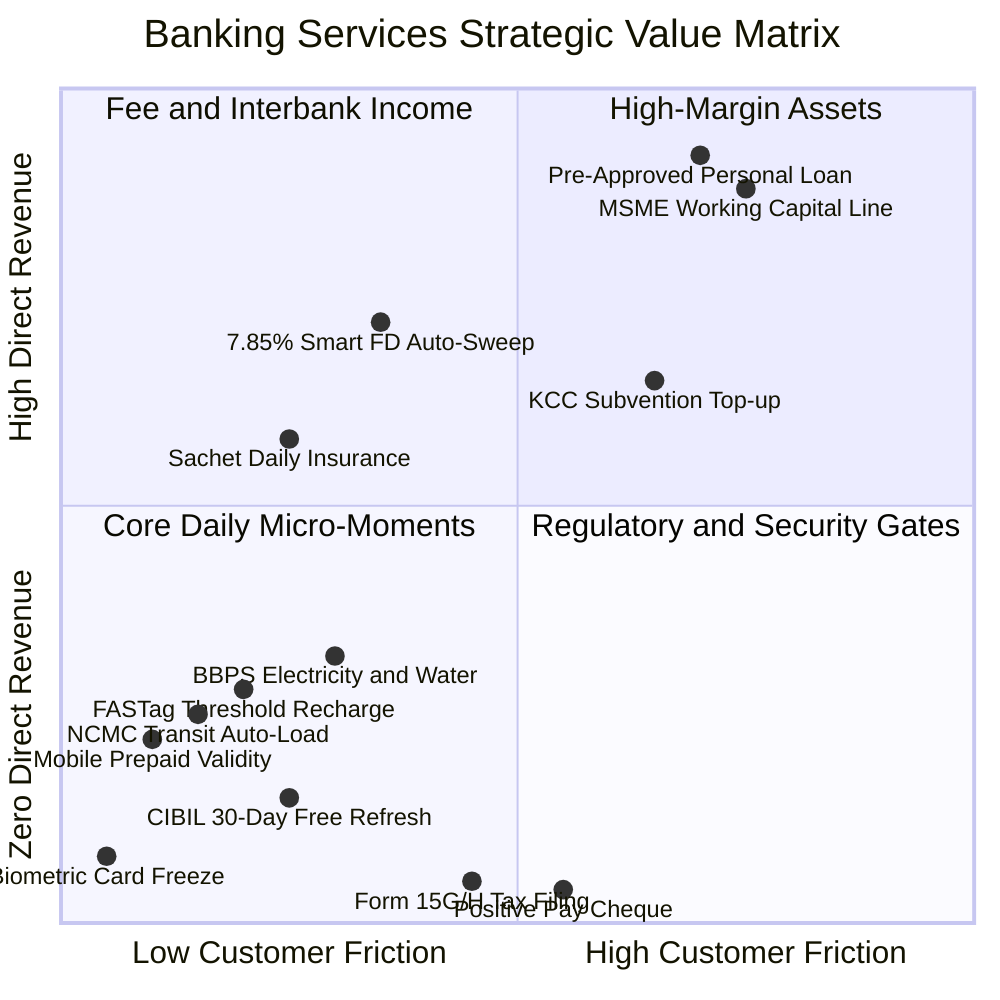

# Master Taxonomy of Indian Banking Services & Predictive Micro-Moments
## The Definitive Compendium of 60+ Retail, MSME, Rural & Regulatory Services for Bharat Banking

---

## Executive Architectural Summary

In traditional Indian banking, mobile apps treat services as static, passive menu items buried 3 to 4 taps deep under "Services", "Bill Pay", or "Settings". Over 80% of digital banking interactions in Tier 2/3/4 India are driven by **daily micro-moments** (mobile recharge, metro transit recharge, electricity bills, credit card payment, checking CIBIL score).

A modern, hyper-personalized banking engine must not merely offer high-margin loans; it must anticipate, automate, and surface **every single banking service**—whether it earns direct fee revenue or acts as a zero-fee trust-building utility—at the exact millisecond of need.

### The Service Revenue vs. Engagement Matrix

---

## Domain 1: Daily Mobility & Transit Micro-Moments

### 1.1. NCMC (National Common Mobility Card) / Metro Smart Card Auto-Load
- **Description**: Predictive transit card recharge for urban metro networks (DMRC, NMRC, BMRC, Maha Metro) and suburban transit.
- **Revenue Model**: Zero direct earning; captures high-frequency daily active usage (DAU) and CASA balances.
- **Predictive AI Trigger / Micro-Moment**: Inferred transit load cadence. For example, customer reloads ₹400 every 10–12 weekdays; on Day 10, when historical balance falls below ₹80, surface a 1-tap recharge card during morning commute hours (07:30–09:00 AM).
- **Customer Benefit**: Zero queueing at ticket counters or vending machines; avoids commuter penalty gate rejections.
- **Bank Benefit**: Customer maintains higher daily liquidity in savings account; primary transit bank status.
- **Regulatory Framework**: RBI National Common Mobility Card (NCMC) Guidelines & e-Mandate Framework.

### 1.2. NHAI FASTag Threshold Predictive Recharge
- **Description**: Electronic toll collection recharge for private vehicles and commercial fleets.
- **Revenue Model**: Nominal merchant fee / float interest on wallet balance.
- **Predictive AI Trigger**: Highway toll debit cluster or balance dipping below ₹200 threshold prior to weekend/holiday travel patterns.
- **Customer Benefit**: Prevents blacklisting at toll plazas and double toll penalty under NHAI rules.
- **Bank Benefit**: Captures toll payment interchange float and vehicle owner profile.

### 1.3. Pre-Paid Mobile Validity Expiry Shield
- **Description**: 1-tap mobile recharge (Jio, Airtel, Vi, BSNL) for self and family members.
- **Revenue Model**: BBPS biller commission (₹0.50–₹2.00 per recharge).
- **Predictive AI Trigger**: 28-day or 84-day recharge cycle tracker. Triggers 48 hours before plan validity expiry based on past recharge timestamp.
- **Customer Benefit**: Prevents sudden incoming call suspension and mobile data disruption.
- **Bank Benefit**: Recurring monthly engagement touchpoint for Bharat users who do not maintain autopay.

---

## Domain 2: Credit Bureau & Financial Health Maintenance

### 2.1. 30-Day CIBIL / Experian Credit Score Free Refresh
- **Description**: Free monthly credit score pull with bureau score drift analysis, active loan count, and credit utilization breakdown.
- **Revenue Model**: Zero-fee service; top-of-funnel customer acquisition and credit health monitoring.
- **Predictive AI Trigger**: Day 30 post previous bureau pull. Surfaces: *"Your CIBIL score refreshed today: 765 (+12 pts). Tap to view factors."*
- **Customer Benefit**: Early detection of erroneous bureau reporting or unauthorized identity theft inquiries.
- **Bank Benefit**: Real-time credit risk monitoring across external lenders; identifies prime borrowers who paid off external loans.
- **Regulatory Framework**: RBI Circular on Free Credit Reports to Individuals (2016) & CIC Regulations.

### 2.2. Credit Card Total vs. Minimum Due Optimizer
- **Description**: Proactive alert for credit card bill statement generation and payment due date.
- **Revenue Model**: Eliminates fee if paid in full; generates revolving interest if customer chooses EMI conversion.
- **Predictive AI Trigger**: Statement generation date + 5 days before due date. Analyzes liquid balance vs total due:
  - If liquid balance $\ge$ total due: Promotes 1-tap *"Pay Total Due (₹18,400) to avoid 42% APR interest"*.
  - If liquid balance $<$ total due: Empathic intervention *"Convert ₹14,000 into 3-month No-Cost EMI to protect credit score"*.
- **Customer Benefit**: Protects customer from predatory revolving interest (36%–45% p.a.) and late fees.
- **Bank Benefit**: Healthy balance between interest income and zero credit default/NPA.

### 2.3. Debt-to-Income (DTI) & Repayment Simulator
- **Description**: Interactive financial health tool calculating impact of taking a new loan or pre-paying existing EMI.
- **Revenue Model**: Zero-earning advisory utility.
- **Predictive AI Trigger**: Inferred elevated debt pressure (DTI $> 0.35$).
- **Customer Benefit**: Complete visibility on future cash-flow buffer.
- **Bank Benefit**: Demonstrates ethical advisory and satisfies RBI fair lending counseling mandates.

---

## Domain 3: Core Account Servicing & Regulatory Compliance

### 3.1. Positive Pay System (PPS) Cheque Confirmation
- **Description**: Mandatory pre-confirmation of key cheque details (payee, amount, date) for cheques issued above ₹50,000.
- **Revenue Model**: Zero-fee regulatory compliance mechanism.
- **Predictive AI Trigger**: Detects high-value cheque book requisition or past cheque issuance history.
- **Customer Benefit**: Protects issuer against cheque tampering, counterfeit clearing, and signature fraud.
- **Bank Benefit**: Eliminates cheque clearing liability and dispute settlement costs.
- **Regulatory Framework**: RBI Guidelines on Introduction of Positive Pay System for Cheque Truncation (2020).

### 3.2. Form 15G / 15H TDS Exemption Submission
- **Description**: Self-declaration form to prevent Tax Deducted at Source (TDS) on fixed/recurring deposit interest for individuals (15G) and senior citizens (15H).
- **Revenue Model**: Zero-fee regulatory service.
- **Predictive AI Trigger**: Annual calendar trigger on **April 1st to April 30th** for all term deposit holders whose estimated interest exceeds ₹40,000 (₹50,000 for seniors).
- **Customer Benefit**: Prevents unnecessary tax deduction and eliminates hassle of claiming tax refunds via ITR filing.
- **Bank Benefit**: Drastic reduction in branch footfall in April; increases deposit retention among pensioners.
- **Regulatory Framework**: Section 197A of Income Tax Act 1961 & CBDT Digital Filing Directives.

### 3.3. TDS Certificate (Form 16A) & Interest Certificate Download
- **Description**: 1-tap generation of quarterly TDS certificates and annual deposit interest summaries.
- **Revenue Model**: Zero-fee operational self-service.
- **Predictive AI Trigger**: End of Q1, Q2, Q3, Q4, and during income tax filing season (June–July).
- **Customer Benefit**: Instant documentation for chartered accountants and ITR filing without branch visits.

### 3.4. Dormant Account & Nominee Verification Audit
- **Description**: Annual re-verification of beneficiary nominee and transaction nudge for secondary savings accounts approaching 12-month inactivity.
- **Revenue Model**: Zero-fee compliance maintenance.
- **Predictive AI Trigger**: Secondary account with zero customer-induced transactions for 10 months (2 months before inoperative status).
- **Customer Benefit**: Prevents account freeze and ensures funds safely pass to legal heirs without probate hurdles.
- **Bank Benefit**: Reduces unclaimed deposit liabilities transferred to RBI's DEA (Depositor Education and Awareness) Fund.
- **Regulatory Framework**: RBI Master Circular on Inoperative Accounts & Nominee Registration Mandates.

### 3.5. Instant Biometric & Geo-Location Card Freeze
- **Description**: 1-tap granular card security controls: lock debit/credit card, disable international transactions, set ATM daily limits, toggle online e-commerce.
- **Revenue Model**: Zero-fee security shield.
- **Predictive AI Trigger**: Unusual midnight transaction, overseas IP login, or high-risk merchant authorization attempt.
- **Customer Benefit**: Total sovereignty and peace of mind over digital payment instruments.
- **Bank Benefit**: Reduces cyber fraud claims under RBI Zero Liability Directives.

---

## Domain 4: BBPS Utility Bill Lifecycle & Subscriptions

### 4.1. BBPS Electricity & Piped Gas Due Date Proximity
- **Description**: Integrated Bharat BillPay fetch and settlement for state electricity boards (Tata Power, BSES, Bescom, UPPCL) and piped gas (IGL, Adani Gas, Mahanagar Gas).
- **Revenue Model**: BBPS biller commission (₹1.50–₹3.00).
- **Predictive AI Trigger**: Automatic bill fetch via BBPS API. Proactive alert surfaced 4 days prior to due date with 1-tap UPI payment.
- **Customer Benefit**: Zero late payment surcharges, avoids electricity disconnection.
- **Bank Benefit**: Retains customer as primary operational payment hub.

### 4.2. Water Tax & Municipal Property Tax Payments
- **Description**: Municipal corporation tax payment and challan retrieval.
- **Revenue Model**: BBPS municipal utility commission.
- **Predictive AI Trigger**: Semi-annual or annual tax assessment cycle.

### 4.3. Subscription Leakage Audit & Pause Helper
- **Description**: Recurring transaction monitor identifying digital subscriptions (Netflix, Prime, Spotify, YouTube, Gym memberships).
- **Revenue Model**: Zero-fee advisory / customer retention.
- **Predictive AI Trigger**: High subscription density ($> 4$ active recurring charges) when cash-flow buffer is tight.
- **Customer Benefit**: Surfaces unused or forgotten subscriptions with 1-tap cancellation assistance.
- **Bank Benefit**: Frees up customer disposable liquidity, improving loan repayment capacity.

---

## Domain 5: Government Schemes & Social Security (DBT)

### 5.1. PMJJBY & PMSBY Annual Auto-Debit Renewal Alert
- **Description**: Government-backed micro-insurance: Pradhan Mantri Jeevan Jyoti Bima Yojana (₹436/yr for ₹2 Lakh life cover) and Pradhan Mantri Suraksha Bima Yojana (₹20/yr for ₹2 Lakh accidental cover).
- **Revenue Model**: Fee commission (₹30–₹40 per policy per year).
- **Predictive AI Trigger**: Annual renewal cycle on **May 15th to May 31st**. Alerts customer to maintain minimum ₹456 balance for auto-debit.
- **Customer Benefit**: Continuous uninterrupted social security for low-income and rural families.
- **Bank Benefit**: Fulfills national financial inclusion targets and deepens rural household ties.

### 5.2. Atal Pension Yojana (APY) Monthly Contribution & Corpus Tracker
- **Description**: Guaranteed government pension scheme for unorganized sector workers (₹1,000–₹5,000/month pension post 60).
- **Revenue Model**: Annual administrative fee commission from PFRDA.
- **Predictive AI Trigger**: Monthly salary/earnings credit day; displays accumulated pension wealth and contribution status.
- **Customer Benefit**: Predictable retirement security for informal and gig economy workers.

### 5.3. Sukanya Samriddhi Yojana (SSY) & PPF Fiscal Year-End Deposit
- **Description**: High-interest sovereign savings schemes for girl child (SSY - 8.2%) and general retirement (PPF - 7.1%).
- **Revenue Model**: Nominal treasury float and government agency commission.
- **Predictive AI Trigger**:
  - **March 10th to March 25th**: Alert if minimum annual contribution (₹250 for SSY, ₹500 for PPF) has not been deposited, preventing account default.
  - **Monthly by 4th of month**: Nudge to deposit before 5th to earn interest for the full calendar month.
- **Customer Benefit**: Maximizes compound interest and prevents account irregularity penalties.
- **Bank Benefit**: Mobilizes long-term sticky government savings balances.

---

## Domain 6: Lending Servicing & Debt Restructuring

### 6.1. Repo Rate Linked Lending Rate (EBLR) Reset Notice
- **Description**: Transparent disclosure of floating home/auto loan interest rate adjustments following RBI Monetary Policy Committee (MPC) repo rate changes.
- **Revenue Model**: Regulatory transparency mandate.
- **Predictive AI Trigger**: MPC repo rate change announcement + quarterly reset cycle.
- **Customer Benefit**: Understands revised EMI vs loan tenure options without hidden spreads.
- **Bank Benefit**: Complete compliance with RBI Floating Rate Loan Circular (2023).

### 6.2. Part-Payment & Loan Pre-Payment Impact Simulator
- **Description**: 1-tap pre-payment of loan principal using festival bonus or liquidity surplus, with interactive choice: *Reduce Monthly EMI* vs *Reduce Loan Tenure*.
- **Revenue Model**: Zero penalty on floating rate loans (RBI mandate); fosters trust.
- **Predictive AI Trigger**: Lumpsum salary bonus or dividend credit ($> ₹50,000$) detected in savings account.
- **Customer Benefit**: Shows exact interest lakhs saved over loan lifetime.
- **Bank Benefit**: Healthy portfolio prepayment with high customer loyalty.

### 6.3. Loan Closure & Digital NOC / Lien Release Certificate
- **Description**: Automated delivery of No Objection Certificate (NOC) and removal of lien on vehicle (Vahan portal) or property title upon final EMI payment.
- **Revenue Model**: Zero-fee closure service.
- **Predictive AI Trigger**: Final EMI clearance.
- **Customer Benefit**: Immediate proof of debt-free status and clean title for vehicle resale.

---

## Domain 7: Wealth, Sovereign Assets & Surplus Management

### 7.1. Sovereign Gold Bond (SGB) Semi-Annual Interest & Maturity Alert
- **Description**: Sovereign Gold Bonds tracking with semi-annual 2.5% p.a. interest payouts and 8-year tax-free maturity redemptions.
- **Revenue Model**: Zero-fee tracking; gold asset servicing.
- **Predictive AI Trigger**: Semi-annual coupon payment date or RBI SGB tranche maturity window.
- **Customer Benefit**: Full clarity on sovereign gold holding value and tax exemption upon maturity.

### 7.2. Liquid Auto-Sweep (Flexi-FD) Threshold Optimization
- **Description**: Automatic transfer of idle savings account balances above ₹25,000 into high-yield 7.85% short-term deposits, with reverse sweep on demand.
- **Revenue Model**: Sticky low-cost deposit growth.
- **Predictive AI Trigger**: Savings balance persistently exceeding ₹50,000 for $> 7$ days without upcoming EMI obligations.
- **Customer Benefit**: Earns 7.85% term deposit yield instead of 3.0% basic savings rate.
- **Bank Benefit**: Retains deposits within the bank rather than losing them to liquid mutual funds.

---

## Domain 8: Special Assisted & Senior Citizen Services

### 8.1. Doorstep Banking Service (DSB) Request
- **Description**: Delivery of cash, pickup of cheques, life certificate (Jeevan Pramaan) verification, and Form 15G submission at the residence of senior citizens (70+ years) and differently-abled individuals.
- **Revenue Model**: Nominal service fee (subsidized per RBI norms).
- **Predictive AI Trigger**: Customer age $> 70$ or senior citizen profile attempting complex service journey.
- **Customer Benefit**: Dignified, safe access to banking without physical branch visits.
- **Regulatory Framework**: RBI Master Circular on Doorstep Banking Services for Senior Citizens.

---

## Complete Service Catalog Summary Table

| Service ID | Service Name | Domain | Direct Fee? | AI Predictive Trigger | RBI / DPDP Regulatory Reference |
| :--- | :--- | :--- | :--- | :--- | :--- |
| `srv_ncmc_reload` | NCMC Metro Transit Recharge | Mobility | No (CASA Float) | Cadence cycle, balance $< ₹80$ at 08:30 AM | RBI NCMC & e-Mandate Rules |
| `srv_fastag_recharge` | FASTag Highway Toll Load | Mobility | No | Balance $< ₹200$ before weekend travel | NHAI NETC Guidelines |
| `srv_mobile_recharge` | Mobile Prepaid Validity Shield | Mobility | Yes (BBPS Comm.) | 48h before 28/84-day cycle expiry | BBPS Consumer Protection |
| `srv_cibil_refresh` | 30-Day Bureau Score Refresh | Credit | No (Trust Engine) | Day 30 post previous pull | RBI Free Credit Report Mandate |
| `srv_credit_card_bill` | Credit Card Due Date Optimizer | Credit | Optional (EMI) | Statement date + 5 days before due | RBI Credit Card Master Direction |
| `srv_positive_pay` | Positive Pay Cheque Confirmation | Compliance | No (Risk Control) | Cheque $> ₹50,000$ issued | RBI PPS Guidelines 2020 |
| `srv_form15g_h` | Form 15G / 15H TDS Exemption | Compliance | No | April 1–30 annual tax window | Income Tax Act Sec 197A |
| `srv_tds_certificate` | Form 16A TDS Download | Compliance | No | Quarterly & Annual ITR filing | CBDT Digital Certificate Norms |
| `srv_biometric_freeze`| Instant Biometric Card Lock | Security | No | Midnight or anomalous debit alert | RBI Zero Liability Policy 2017 |
| `srv_bbps_electricity`| Electricity Bill Proximity | Utilities | Yes (BBPS Comm.) | 4 days before due date | BBPS Operating Guidelines |
| `srv_subscription_trim`| Subscription Leakage Helper | Financial Care | No | High recurring count + tight cash | RBI Recurring Mandate Framework |
| `srv_pmjjby_pmsby` | PMJJBY & PMSBY Annual Renewal | Government | Yes (Fee Comm.) | May 15–31 annual renewal | Ministry of Finance DBT Norms |
| `srv_apy_pension` | Atal Pension Yojana Tracker | Government | Yes (Admin Fee) | Monthly earnings credit day | PFRDA APY Directives |
| `srv_ppf_ssy_deposit` | PPF / SSY Fiscal Year-End | Government | No (Sticky Float) | March 15 or 4th of month | Government Savings Bank Act |
| `srv_eblr_reset` | Floating Rate Repo Reset Notice | Lending | No | Post-RBI MPC rate change | RBI Floating Rate Loans 2023 |
| `srv_loan_prepay` | EMI Pre-Payment Savings Simulator | Lending | No | Bonus or lumpsum credit $> ₹50k$ | RBI Fair Practices Code |
| `srv_loan_noc` | Digital NOC & Lien Release | Lending | No | Final EMI clearance | RBI Fair Lending NOC Mandate |
| `srv_sgb_interest` | Sovereign Gold Bond Coupon | Wealth | No | Semi-annual 2.5% payout date | RBI Sovereign Gold Bond Scheme |
| `srv_smart_autosweep` | Flexi-FD Auto-Sweep | Wealth | No (CASA Ret.) | Balance $> ₹50k$ for 7 days | RBI Deposit Interest Master Rules |
| `srv_doorstep_bank` | Senior Doorstep Banking | Assisted | Nominal Fee | Senior $> 70$ yrs / Health tight | RBI Doorstep Banking Circular |
