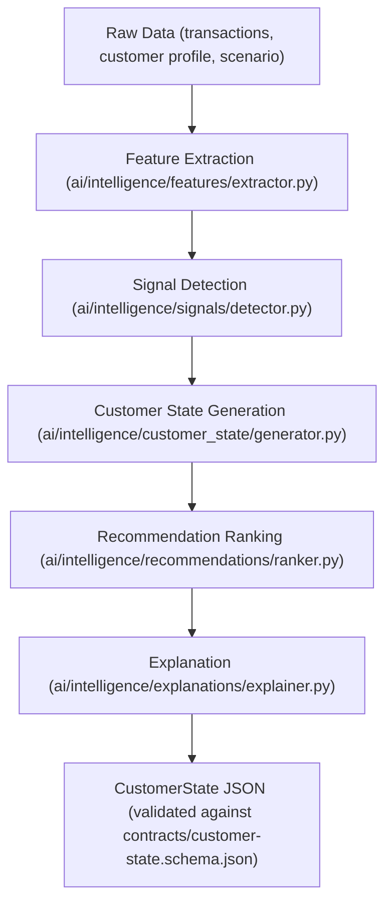
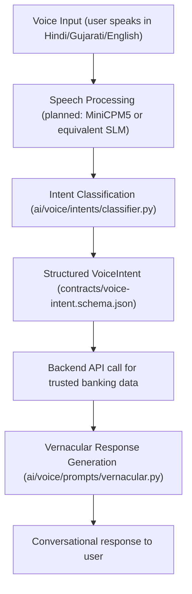

# VZEYA AI/ML Architecture

**Owner:** Ubaid Khan

## Overview
The AI system is a **hybrid intelligence pipeline** with two parts:
1. **Backend Intelligence Pipeline** — runs on server, understands the customer
2. **On-Device Voice Layer** — runs locally (planned), understands how the customer wants to interact

> [!IMPORTANT]
> The SLM (Small Language Model) does NOT independently make banking/credit decisions. All financial decisions and data come from the backend. The SLM is only responsible for natural language understanding and conversational response generation.

## Intelligence Pipeline

### Feature Extraction
- **Input**: Customer profile, transaction history, scenario data
- **Output**: Numerical/categorical features dict
- **Current features computed**:
  - `total_debit_volume`: Total spending
  - `metro_frequency_30d`: Metro transaction count
  - `utility_bill_count`: Utility bill count
  - `top_categories`: Spending by category
- **Design**: Stateless function, no side effects
- **File**: `ai/intelligence/features/extractor.py`

### Signal Detection
- **Input**: Features + scenario data
- **Output**: Dictionary of behavioral/life-stage/financial/risk signals
- **Signal types**:
  - **Behavioral**: commute_habit_detected, commute patterns
  - **Life-stage**: medical_surge, medical events
  - **Financial**: stress_alert, savings_trend, emi_pressure
  - **Risk**: anomaly_score, suppress_promotions
- Signals are GENERIC key-value pairs, not hardcoded to specific events
- **File**: `ai/intelligence/signals/detector.py`

### Customer State Generation
- **Input**: Customer profile, signals, recommendations, features
- **Output**: CustomerState conforming to contract schema
- **Determines**:
  - `financial_health`: thriving/stable/tight/stress (based on DTI and signals)
  - `state_type`: normal/financial_stress/medical_event/fraud_alert/surplus/life_change
- **File**: `ai/intelligence/customer_state/generator.py`

### Recommendation / Next-Best-Action
- **Input**: Signals, financial health
- **Output**: Ranked list of recommendations with ethical guardrails
- **CRITICAL ETHICAL RULE**: When health='stress' or DTI > 0.40:
  - personal_loan, credit_card, payday_advance, overdraft, investment_upsell are SUPPRESSED
  - priority set to 0, suppressed flag set to true
  - Replaced with guidance, support, and stabilization recommendations
- **Recommendation hierarchy follows responsible AI principles**:
  1. Safety/Eligibility
  2. Suitability/Affordability
  3. Customer Need
  4. Expected Benefit
  5. Commercial consideration (lowest priority)
- **File**: `ai/intelligence/recommendations/ranker.py`

### Explanation Generation
- **Input**: Recommendations, signals
- **Output**: Human-readable explanations for each recommendation
- Every card/recommendation must have a 'reason' and 'why' field
- Supports explainability requirement
- **File**: `ai/intelligence/explanations/explainer.py`

## Voice SLM Layer

### Intent Classification
- **Currently**: Rule-based keyword matching (pattern lists per intent)
- **Planned**: MiniCPM5 or equivalent small language model
- **Supports**: English, Hindi (hi), Gujarati (gu)
- **Intent categories**: PAY_METRO, CHECK_BALANCE, CHECK_EMI, PAY_BILL, MEDICAL_CLAIM_HELP, SAVE_SURPLUS, REVIEW_COMMITMENTS, LOCK_CARD, GENERAL_QUERY
- **Entity extraction**: merchant, amount, category, action
- **File**: `ai/voice/intents/classifier.py`

### Vernacular Response Templates
- Pre-defined response templates per intent per language
- Three languages: English, Hindi, Gujarati
- Responses reference trusted backend data (amounts, dates, merchants)
- **File**: `ai/voice/prompts/vernacular.py`

## Responsibility Split
> [!NOTE]
> **Backend AI understands the customer.**
> **On-device AI understands how the customer wants to interact.**

The SLM:
- **DOES**: voice interaction, intent detection, vernacular understanding, conversational navigation
- **DOES NOT**: make financial decisions, approve loans, assess creditworthiness, access raw financial data directly

## Current Implementation Status
| Component | Status | Notes |
|---|---|---|
| Feature Extraction | Implemented | Rule-based, from transaction data |
| Signal Detection | Implemented | Rule-based, merges computed + scenario signals |
| Customer State Generation | Implemented | Deterministic from signals |
| Recommendation Ranking | Implemented | With ethical suppression |
| Explanation Generation | Implemented | Basic template-based |
| Voice Intent Classification | Implemented | Rule-based keyword matching |
| Vernacular Responses | Implemented | EN, HI, GU templates |
| MiniCPM5 Integration | NOT started | Planned for on-device SLM |
| Real ML Models | NOT started | All logic is currently rule-based |
| Schema Validation | Implemented | jsonschema validation in run.py |
