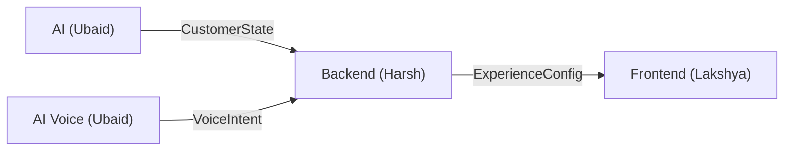

# Interface Contracts

This documents the three interface contracts between the AI, Backend, and Frontend systems.

## Overview
The three JSON Schema contracts in `/contracts/` are the system's formal API boundaries. They define exactly what data crosses between the three ownership domains. Changes to contracts require coordination among ALL team members.



## Contract 1: CustomerState (`contracts/customer-state.schema.json`)
- **Producer**: Ubaid (ai/intelligence/)
- **Consumer**: Harsh (apps/backend/app/experience/composer.py)
- **Purpose**: Complete financial, behavioral, and psychological state of the customer
- **Validation**: AI pipeline validates with jsonschema before outputting

**Required fields**: `customer_id`, `financial_health`, `signals`
**Optional fields**: `customer_name`, `state_type`, `life_stage`, `balance`, `recommendations`

**Extended Runtime Fields**:
In production, the AI output (`customer-state.json`) enriches this schema dynamically with complex objects:
- `cash_flow_forecast`: Predicts liquidity runway, deficits, and next income dates.
- `spend_profile`: Provides 50/30/20 budget allocations, top spend categories, and leakage alerts.
- `bharat_archetype`: Categorizes the user (e.g., `urban_commuter`).
- `cryptographic_ledger`: An immutable SHA-256 block chain recording every recommendation decision and suppression (e.g., hiding loans due to high DTI) for RBI compliance.
- `budget_allocation_50_30_20`: Inside `signals`, tracks Needs/Wants/Savings splits precisely.

**Field Type Constraints**:
- `state_type`: Enum (`normal`, `life_change`, `financial_stress`, `medical_event`, `fraud_alert`, `surplus`)
- `financial_health`: Enum (`thriving`, `stable`, `tight`, `stress`)
- `signals`: Object (`additionalProperties: true`). Used for open-ended flags like `commute_detected` (bool), `debt_to_income_ratio` (number).

**Example payload (Normal)**:
```json
{
  "customer_id": "cust_bharat_001",
  "customer_name": "Rahul Sharma",
  "state_type": "normal",
  "financial_health": "thriving",
  "signals": {
    "commute_detected": true,
    "savings_trend": "positive",
    "debt_to_income_ratio": 0.18,
    "anomaly_score": 4,
    "budget_allocation_50_30_20": {
      "rule_status": "optimal"
    }
  },
  "life_stage": ["early_career", "metro_commuter"],
  "balance": {
    "available": 42680,
    "savings": 185000,
    "currency": "INR"
  },
  "recommendations": [
    {
      "id": "rec_smart_fd",
      "category": "savings",
      "title": "Smart FD @ 7.85% APY",
      "reason": "Healthy surplus detected",
      "priority": 85,
      "suppressed": false
    }
  ]
}
```

**Key design decisions**:
- `signals` is an open object (`additionalProperties: true`) — allows arbitrary signals without schema changes
- `financial_health` is an enum: thriving, stable, tight, stress
- `state_type` is an enum: normal, life_change, financial_stress, medical_event, fraud_alert, surplus
- `recommendations[].suppressed` flag allows ethical filtering downstream
- All signal names are generic (e.g. `commute_detected` not `metro_detected`)

## Contract 2: ExperienceConfig (`contracts/experience.schema.json`)
- **Producer**: Harsh (apps/backend/app/experience/composer.py)
- **Consumer**: Lakshya (apps/frontend/)
- **Purpose**: Instructs the mobile UI how to compose its screen

**Required fields**: `primary_actions`, `priority_modules`
**Optional fields**: `customer_id`, `secondary_actions`, `deprioritized_modules`, `hero_card`, `context_cards`, `language`, `interaction_mode`

**Field Type Constraints**:
- `context_cards[].layer`: Enum (`DO`, `KNOW`, `PLAN`, `CONSIDER`)

**Example payload (Normal state)**:
```json
{
  "customer_id": "cust_bharat_001",
  "primary_actions": ["metro", "upi", "fastag"],
  "secondary_actions": ["bill_pay", "send_money"],
  "priority_modules": ["commute_habit", "upcoming_emi", "smart_savings"],
  "deprioritized_modules": [],
  "hero_card": {
    "id": "hero_metro",
    "title": "Your 8:40 AM Metro Commute",
    "subtitle": "Tap to instantly pay \u20b940 with 1-click UPI",
    "action_label": "Pay \u20b940",
    "action_type": "INSTANT_METRO_PAY",
    "badge": "ROUTINE HABIT",
    "accent": "#2563EB",
    "why": "Frequent weekday commute pattern detected"
  },
  "context_cards": [
    {
      "id": "card_morning_metro",
      "type": "action",
      "layer": "DO",
      "priority": 94,
      "title": "Your morning Metro",
      "description": "Regular Noida Sec 62 commute",
      "reason": "Based on your 22-trip monthly pattern",
      "primary_action": {
        "label": "Pay \u20b940 Again",
        "action_type": "quick_pay"
      },
      "dismissible": true
    }
  ],
  "language": "en",
  "interaction_mode": "adaptive"
}
```

**Example payload (Financial Stress)**:
```json
{
  "customer_id": "cust_bharat_001",
  "primary_actions": ["review_commitments", "pause_subscriptions"],
  "secondary_actions": ["speak_with_mitra", "view_cashflow"],
  "priority_modules": ["cashflow_advisory", "obligations_planner"],
  "deprioritized_modules": ["personal_loans", "credit_cards", "discretionary_spend"],
  "hero_card": {
    "id": "hero_stress",
    "title": "Cash Flow Guidance Active",
    "subtitle": "Upcoming obligations are higher this cycle",
    "action_label": "Review Plan",
    "action_type": "OPEN_STRESS_MODAL",
    "badge": "CARE & GUIDANCE",
    "accent": "#D97706",
    "why": "Liquid reserve dropped to ~15 days"
  },
  "language": "en",
  "interaction_mode": "adaptive"
}
```

**Example payload (Fraud Alert)**:
```json
{
  "customer_id": "cust_bharat_001",
  "primary_actions": ["lock_card", "dispute_tx"],
  "secondary_actions": ["call_support"],
  "priority_modules": ["security_center", "recent_tx_review"],
  "deprioritized_modules": ["all_marketing", "investments"],
  "hero_card": {
    "id": "hero_fraud",
    "title": "Unusual Activity Detected",
    "subtitle": "\u20b931,800 debited at 2:14 AM. Was this you?",
    "action_label": "Secure Account",
    "action_type": "LOCKDOWN_FLOW",
    "badge": "SECURITY ALERT",
    "accent": "#DC2626",
    "why": "Transaction pattern severely deviates from history"
  },
  "language": "en",
  "interaction_mode": "alert"
}
```

**Example payload (Medical Event)**:
```json
{
  "customer_id": "cust_bharat_001",
  "primary_actions": ["claim_insurance", "request_emr"],
  "secondary_actions": [],
  "priority_modules": ["insurance_dashboard", "medical_loans"],
  "deprioritized_modules": ["discretionary_spend"],
  "hero_card": {
    "id": "hero_medical",
    "title": "Medical Claim Assistance",
    "subtitle": "We noticed a large hospital bill. Need help?",
    "action_label": "View Options",
    "action_type": "OPEN_MEDICAL_MODAL",
    "badge": "SUPPORT",
    "accent": "#0D9488",
    "why": "Detected ₹48,200 transaction at Apollo Hospitals"
  },
  "language": "en"
}
```

**Key design decisions**:
- `context_cards[].layer` enum (DO/KNOW/PLAN/CONSIDER) creates an attention hierarchy
- `deprioritized_modules` explicitly lists what was removed (auditable)
- `hero_card.why` provides explainability
- All action types are strings (extensible without schema changes)

## Contract 3: VoiceIntent (`contracts/voice-intent.schema.json`)
- **Producer**: Ubaid (ai/voice/)
- **Consumer**: Harsh (apps/backend/) and Lakshya (MitraChatScreen)
- **Purpose**: Normalized multi-lingual voice intents

**Required fields**: `intent`, `language`
**Optional fields**: `confidence`, `entities`, `response_text`, `suggested_actions`

**Field Type Constraints**:
- `language`: Enum (`en`, `hi`, `gu`)
- `intent`: Enum (`PAY_METRO`, `CHECK_BALANCE`, `CHECK_EMI`, `PAY_BILL`, `MEDICAL_CLAIM_HELP`, `SAVE_SURPLUS`, `REVIEW_COMMITMENTS`, `LOCK_CARD`, `GENERAL_QUERY`)
- `confidence`: Number (between 0 and 1)

**Example payload**:
```json
{
  "intent": "CHECK_EMI",
  "language": "hi",
  "confidence": 0.94,
  "entities": {
    "category": "home_loan",
    "amount": 16500
  },
  "response_text": "\u0906\u092a\u0915\u0940 \u0905\u0917\u0932\u0940 \u0939\u094b\u092e \u0932\u094b\u0928 \u0908\u090f\u092e\u0906\u0908 \u20b916,500 \u0915\u0940 16 \u0938\u093f\u0924\u0902\u092c\u0930 \u0915\u094b \u0928\u093f\u0930\u094d\u0927\u093e\u0930\u093f\u0924 \u0939\u0948\u0964",
  "suggested_actions": ["CONFIRM", "DISMISS", "DETAILS"]
}
```

**Current intents** (examples, not exhaustive):
- PAY_METRO, CHECK_BALANCE, CHECK_EMI, PAY_BILL
- MEDICAL_CLAIM_HELP, SAVE_SURPLUS, REVIEW_COMMITMENTS
- LOCK_CARD, GENERAL_QUERY

**Key design decisions**:
- `intent` is enum-typed for safety but can be extended
- `entities` is open object for flexibility
- `response_text` contains the localized conversational response
- `suggested_actions` enables quick-reply chips in UI

## Contract Evolution Protocol
1. Proposer creates PR with schema change and example payloads
2. ALL three team members review
3. Corresponding Pydantic models (backend) and TypeScript types (frontend) must be updated simultaneously
4. All tests must pass before merge
5. Update mock files in frontend to match new schema

