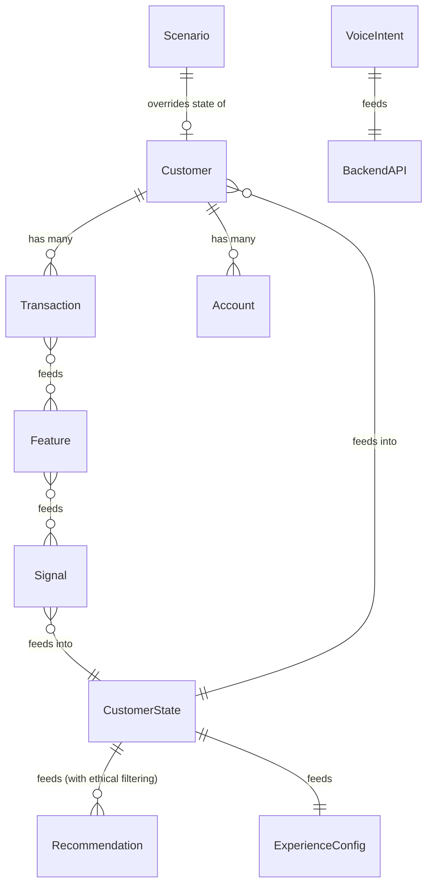

# Data Model

## Overview
VZEYA uses synthetic data for the hackathon prototype. There is no persistent database — data is loaded from JSON files at runtime.

## Conceptual Entities & Entity Relationships

### Customer
- `id`: Unique identifier (e.g. `cust_bharat_001`)
- `name`: Full name
- `phone`, `email`: Contact info
- `monthly_income`: Monthly income in INR
- `kyc_tier`: KYC verification level
- `credit_score`: Credit score
- `language`: Preferred language code
- `accounts`: Linked bank accounts
- Source: `data/seed/customers.json`

### Account
- `type`: savings, current, etc.
- `number`: Account number (masked)
- `balance`: Current balance
- Embedded within Customer

### Transaction
- `id`: Unique identifier
- `customer_id`: Owner reference
- `amount`: Transaction amount
- `type`: debit or credit
- `category`: transport, food, bills, healthcare, salary, emi, etc.
- `merchant`: Merchant name
- `timestamp`: ISO 8601 timestamp
- `is_recurring`: Whether this is a recurring transaction
- `frequency`: daily, weekly, monthly (if recurring)
- Source: `data/seed/transactions.json`

### Scenario
- `name`: Scenario identifier (normal, life-change, financial-stress)
- `title`: Human-readable title
- `customer_id`: Which customer this scenario applies to
- `balance`: Override balance for this scenario
- `signals`: Pre-configured signal values
- Source: `data/scenarios/*.json`

### Feature (computed)
- Extracted by `ai/intelligence/features/extractor.py`
- Examples: total_debit_volume, metro_frequency_30d, utility_bill_count, top_categories
- Computed from Transactions at runtime, not persisted

### Signal (computed)
- Detected by `ai/intelligence/signals/detector.py`
- Examples: commute_habit_detected, medical_surge, stress_alert, savings_trend, emi_pressure
- Derived from Features + Scenario signals
- Open-ended key-value pairs (not hardcoded to specific events)

### CustomerState (contract output)
- Generated by `ai/intelligence/customer_state/generator.py`
- Conforms to `contracts/customer-state.schema.json`
- Combines: customer identity + financial health + signals + life stage + balance + recommendations
- Passed from AI domain to Backend domain

### Recommendation (within CustomerState)
- `id`: Unique recommendation identifier
- `category`: guidance, support, savings, credit, security, transport, healthcare
- `title`: Human-readable title
- `reason`: Why this recommendation was generated
- `priority`: Numerical priority (0-100)
- `suppressed`: Boolean — whether ethical guardrails suppressed this

### ExperienceConfig (contract output)
- Generated by `apps/backend/app/experience/composer.py`
- Conforms to `contracts/experience.schema.json`
- Translates CustomerState into UI instructions
- Contains: primary_actions, priority_modules, hero_card, context_cards, language, interaction_mode

### VoiceIntent (contract output)
- Generated by `ai/voice/intents/classifier.py`
- Conforms to `contracts/voice-intent.schema.json`
- Contains: intent, language, confidence, entities, response_text, suggested_actions

## Data Sources

| Entity | Source | Format | Persisted? |
|---|---|---|---|
| Customer | data/seed/customers.json | JSON array | Yes (file) |
| Transaction | data/seed/transactions.json | JSON array | Yes (file) |
| Scenario | data/scenarios/*.json | JSON object | Yes (file) |
| Feature | Runtime computation | Python dict | No |
| Signal | Runtime computation | Python dict | No |
| CustomerState | AI pipeline output | JSON object | Written to customer-state.json |
| Recommendation | AI pipeline output | JSON array | Within CustomerState |
| ExperienceConfig | Backend computation | JSON object | Served via API |
| VoiceIntent | Voice pipeline output | JSON object | Written to voice-intent.json |

## Important Design Decisions
- No database is used — all state is derived from seed data + scenario selection at runtime
- This is intentional for a hackathon prototype
- For production, Transactions and CustomerState would be stored in a database
- Signals use generic key-value pairs, not hardcoded fields, to support arbitrary behavioral patterns
