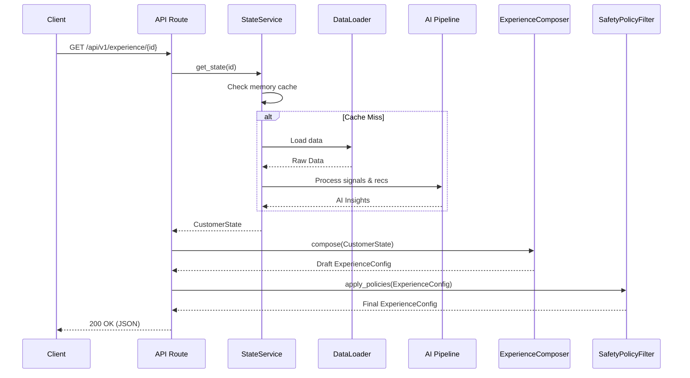
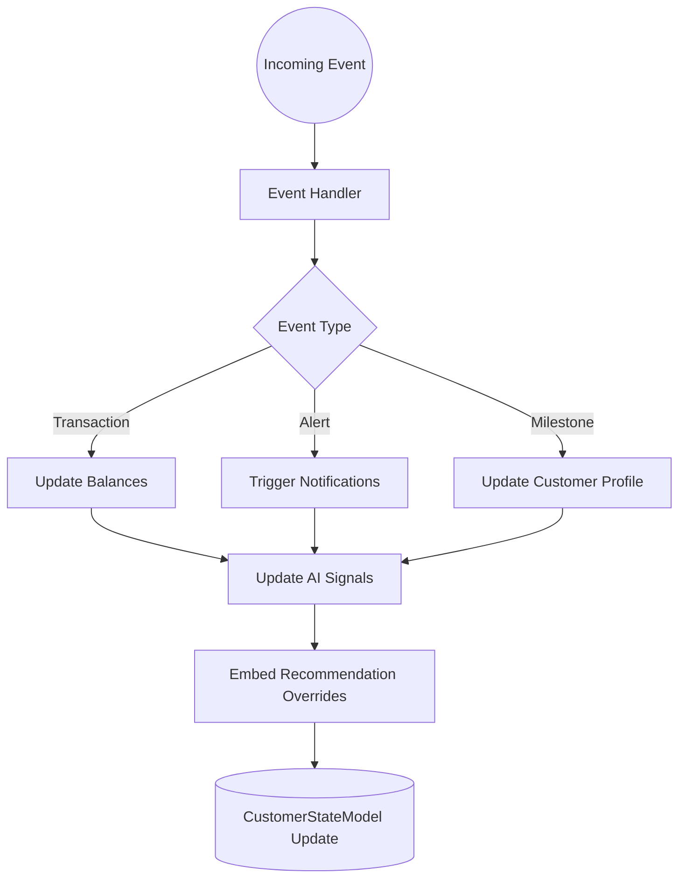
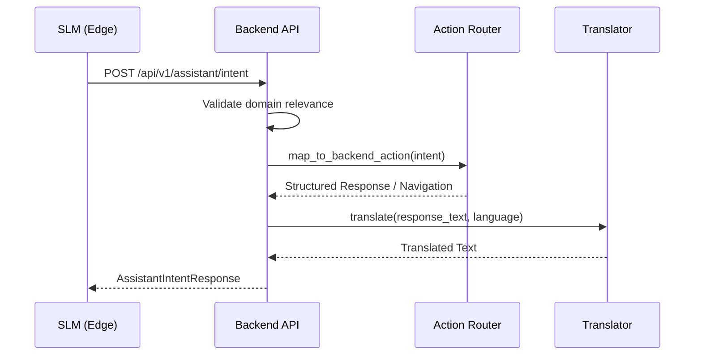
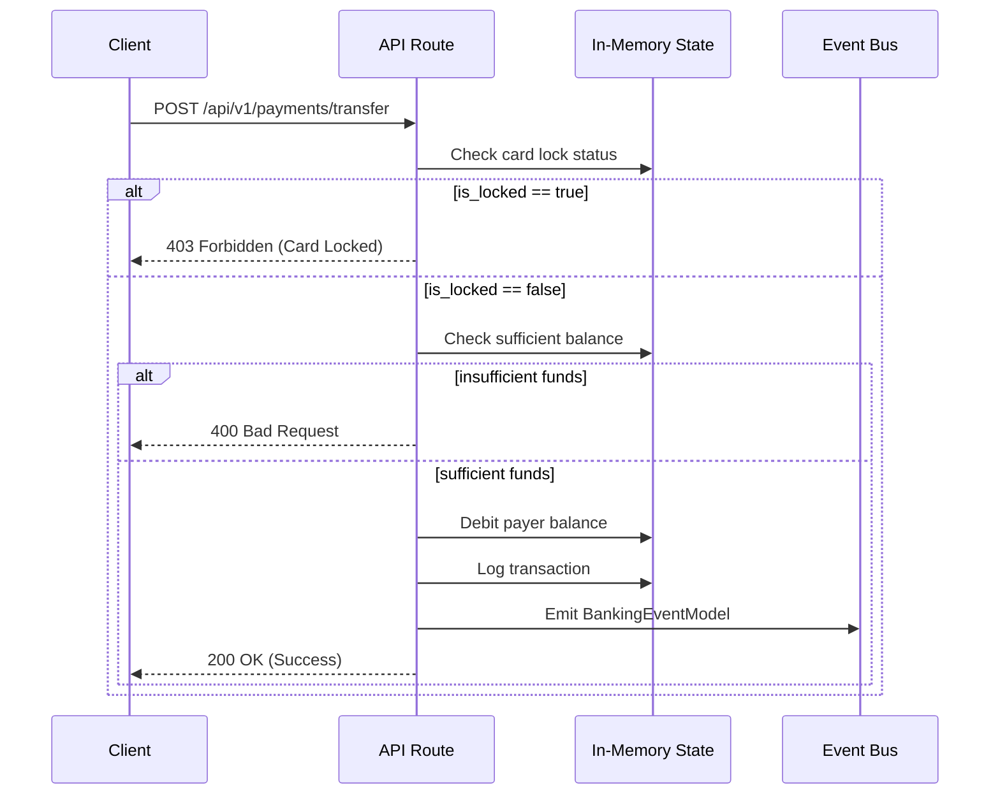

# Neutron-0/ABC-Bank API Documentation

This document contains exhaustive API documentation for the backend FastAPI server located at `apps/backend/`. All routes are defined in `apps/backend/app/api/routes.py`.

- **Base URL:** `http://localhost:8000`
- **API Prefix:** `/api/v1`

## API Route Map

```mermaid
flowchart TD
    Client((Client)) --> Root[/Root Endpoints\]
    Client --> API[/API v1 Endpoints\]
    
    Root --> H["GET /health"]
    Root --> I["GET /inspector"]
    Root --> VI["GET /voice-inspector"]
    
    API --> Core[Core & State]
    API --> Auth[Authentication]
    API --> Cards[Cards & Transactions]
    API --> Asst[AI Assistant]
    API --> Sim[Simulation & Events]
    
    Core --> Exp["GET /experience/{id}"]
    Core --> Cust["GET /customer/{id}"]
    
    Auth --> PinSetup["POST /auth/pin/setup"]
    Auth --> PinVerify["POST /auth/pin/verify"]
    
    Cards --> CardGet["GET /cards/{id}"]
    Cards --> CardCtrl["POST /cards/controls"]
    Cards --> Txns["GET /transactions/{id}"]
    Cards --> Pay["POST /payments/transfer"]
    Cards --> Loan["POST /loans/disburse"]
    
    Asst --> AInit["GET /assistant/init"]
    Asst --> AChat["POST /assistant/chat"]
    Asst --> AInt["POST /assistant/intent"]
    Asst --> VInt["POST /voice/intent"]
    
    Sim --> SSwitch["POST /scenario/switch"]
    Sim --> Evts["POST /events"]
```

---

## Root Endpoints

### `GET /health`
- **Purpose:** Health check
- **Auth:** None
- **Response:** `{"status": "healthy"}`

### `GET /inspector`
- **Purpose:** Serves AI inspector HTML dashboard
- **Response:** HTML page from `ai/inspector.html`

### `GET /voice-inspector`
- **Purpose:** Serves voice SLM inspector dashboard
- **Response:** HTML page from `ai/voice_inspector.html`

---

## API v1 Endpoints

### Core & Customer State

#### `GET /api/v1/customer/{customer_id}`
- **Purpose:** Retrieve full customer state including financial health, signals, and recommendations.
- **Auth:** None (customer_id in path)
- **Path Params:** `customer_id` (string)
- **Response:** `CustomerStateModel` JSON
- **Error:** `404 Not Found` if customer does not exist.
- **Flow:** `StateService.get_state()` &rarr; memory cache &rarr; `DataLoader` &rarr; AI pipeline &rarr; fallback.

#### `GET /api/v1/experience/{customer_id}`
- **Purpose:** Get UI experience configuration derived from customer state.
- **Response:** `ExperienceConfigModel` JSON (`hero_card`, `context_cards` with DO/KNOW/PLAN/CONSIDER layers, `primary_actions`, `deprioritized_modules`).

**Experience Endpoint Sequence:**

---

### Simulation & Events

#### `POST /api/v1/scenario/switch`
- **Purpose:** Demo scenario switcher (`normal`, `surplus`, `financial_stress`, `medical_event`, `fraud_alert`).
- **Request:** `{"scenario": "financial_stress", "customer_id": "cust_01"}`
- **Response:** Updated State & Experience.
- **Side effects:** Flushes in-memory state cache.

#### `POST /api/v1/events`
- **Purpose:** Generic banking event ingestion.
- **Request:** `BankingEventModel` JSON (transaction, alert, milestone).
- **Response:** Updated `CustomerStateModel`.
- **Side effects:** Adjusts balances, updates AI signals, embeds recommendation overrides.

**Event Ingestion Flow:**

---

### AI Assistant & Voice

#### `POST /api/v1/assistant/intent`
- **Purpose:** Execute structured intent from SLM (e.g., `CHECK_BALANCE`, `CHECK_EMI`, `PAY_METRO`, `LOCK_CARD`, `PAY_BILL`).
- **Request:** `AssistantIntentRequest` (intent, language, entities).
- **Response:** `AssistantIntentResponse` (response_text, action_chips, navigation).
- **Flow:** Validates domain relevance &rarr; maps to backend action &rarr; translates (EN/HI/GU).

**Assistant Intent Sequence:**

#### `POST /api/v1/voice/intent`
- **Purpose:** Legacy voice intent classification.
- **Request:** `VoiceIntentModel`.
- **Response:** Classified intent with confidence.
- **Note:** Uses `VoiceIntentClassifier` from `ai.voice.intents.classifier`.

#### `GET /api/v1/assistant/init`
- **Purpose:** Initialize Mitra chat screen.
- **Query Params:** `language` (en/hi/gu).
- **Response:** Greeting messages in requested language.

#### `POST /api/v1/assistant/chat`
- **Purpose:** Mitra conversational endpoint.
- **Request:** `AssistantChatMessageRequest`.
- **Response:** Structured replies, action chips, navigation routing.

---

### Authentication

#### `POST /api/v1/auth/register`
- **Purpose:** Registers a new customer profile and returns a JWT token.
- **Request:** `{name, phone, email, password, monthly_income, language, city, state}`
- **Response:** JWT access token.

#### `POST /api/v1/auth/login`
- **Purpose:** Authenticates customer via identifier and password.
- **Request:** `{identifier, password}`
- **Response:** JWT access token and active banking session summary.

#### `GET /api/v1/auth/me`
- **Purpose:** Protected endpoint returning authenticated customer profile.
- **Auth:** Requires Bearer JWT.
- **Response:** Customer profile & state details.

#### `POST /api/v1/auth/pin/setup`
- **Purpose:** Create cryptographic PIN.
- **Request:** `{customer_id, pin}`
- **Security:** PBKDF2-HMAC-SHA256, 100k iterations, 16-byte random salt.
- **Response:** Success/failure.

#### `POST /api/v1/auth/pin/verify`
- **Purpose:** Verify PIN.
- **Request:** `{customer_id, pin}`
- **Security:** `hmac.compare_digest` (constant-time), rate limiting (5 attempts &rarr; 15-min lockout).
- **Response:** Success/failure with remaining attempts.
- **Error:** `403 Forbidden` if locked out.

---

### Cards & Transactions

#### `GET /api/v1/cards/{customer_id}`
- **Purpose:** Get card states (`is_locked`, `atmLimit`, etc.).
- **Response:** Card control configuration.

#### `POST /api/v1/cards/controls`
- **Purpose:** Update card lock status and limits.
- **Request:** `{customer_id, is_locked, limits...}`
- **Side effects:** Persists to in-memory `_card_controls`.

#### `GET /api/v1/transactions/{customer_id}`
- **Purpose:** Get combined runtime ledger and historic database transactions.
- **Response:** Array of transactions (both in-memory recent + DB historical).

#### `POST /api/v1/payments/transfer`
- **Purpose:** Execute money transfer.
- **Request:** `{customer_id, amount, recipient, category}`
- **Validation:** Card not locked, sufficient balance.
- **Side effects:** Debits payer, logs transaction, emits `BankingEventModel`.
- **Error:** `403 Forbidden` if card locked, `400 Bad Request` if insufficient funds.

**Payment Transfer Sequence:**

#### `POST /api/v1/loans/disburse`
- **Purpose:** Instant credit disbursement.
- **Validation:** Max ₹1,50,000.
- **Side effects:** Credits balance, emits event.

#### `POST /api/v1/cards/dynamic-cvv`
- **Purpose:** Generates a single-use 5-minute time-bound virtual dynamic CVV.
- **Request:** `{customer_id, card_id}`
- **Response:** Generated dynamic CVV string.

---

### Identity & KYC

#### `POST /api/v1/kyc/submit`
- **Purpose:** PAN/Aadhaar Video-KYC submission.
- **Request:** `{customer_id, pan, aadhaar, latitude, longitude, selfie_verified}`
- **Response:** Verification status and tier updates.

---

### Banking Relief Services & Mandates

#### `POST /api/v1/claims/submit`
- **Purpose:** TPA medical claim submission.
- **Request:** `{customer_id, hospital, amount, notes}`
- **Response:** Claim status and tracking id.

#### `POST /api/v1/mandates/pause`
- **Purpose:** e-Mandate subscription pause.
- **Request:** `{customer_id, mandate_name, is_paused}`
- **Response:** Status of mandate pause.

#### `POST /api/v1/loans/grace`
- **Purpose:** Grants a 10-day penalty-free EMI grace buffer.
- **Request:** `{customer_id, loan_id, days}`
- **Response:** Updated loan schedule.

#### `POST /api/v1/loans/split`
- **Purpose:** Splits upcoming monthly EMI into two equal 50% installments.
- **Request:** `{customer_id, loan_id}`
- **Response:** Modified EMI schedule.

#### `POST /api/v1/loans/sweep-deficit`
- **Purpose:** Partial auto-sweep deficit from fixed deposits/emergency buffer.
- **Request:** `{customer_id, loan_id, amount}`
- **Response:** Auto-sweep confirmation.

#### `POST /api/v1/loans/cooling-off-cancel`
- **Purpose:** Statutory 3-day cooling-off lookup cancellation without penalty.
- **Request:** `{customer_id, contract_id}`
- **Response:** Cancellation status.

---

### Investments & ASBA

#### `POST /api/v1/investments/asba/bid`
- **Purpose:** Places SEBI UPI ASBA lien blocking for IPO applications.
- **Request:** `{customer_id, ipo_name, shares, amount, upi_id}`
- **Response:** ASBA bid status and blocked amount.

---

### Insurance & Protection

#### `GET /api/v1/insurance/plans/{customer_id}`
- **Purpose:** Fetches pre-approved IRDAI standard health and term life insurance plans.
- **Response:** List of eligible micro-insurance plans.

#### `POST /api/v1/insurance/enroll`
- **Purpose:** 1-Click Digital Insurance Enrollment under IRDAI guidelines.
- **Request:** `{customer_id, plan_id, sum_insured, nominee_name, nominee_relation}`
- **Response:** Enrollment confirmation and policy certificate.

---

## Pydantic Models

- **`CustomerStateModel`**: `customer_id`, `financial_health` (thriving/stable/tight/stress), `balances`, `signals`, `recommendations`.
- **`ExperienceConfigModel`**: `hero_card`, `context_cards[]`, `primary_actions[]`, `deprioritized_modules[]`.
- **`BankingEventModel`**: `event_type`, `customer_id`, `data`, `timestamp`.
- **`AssistantIntentRequest`/`Response`**: `intent`, `language`, `entities`, `response_text`, `action_chips`.
- **`VoiceIntentModel`**: `intent`, `language`, `entities`, `confidence`.
