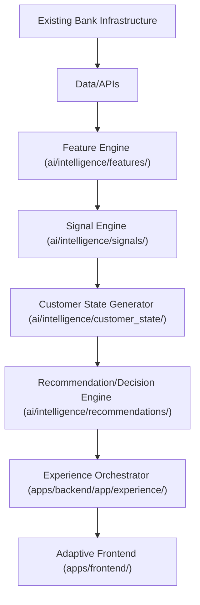
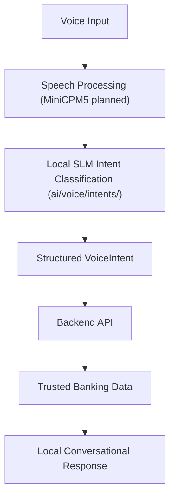
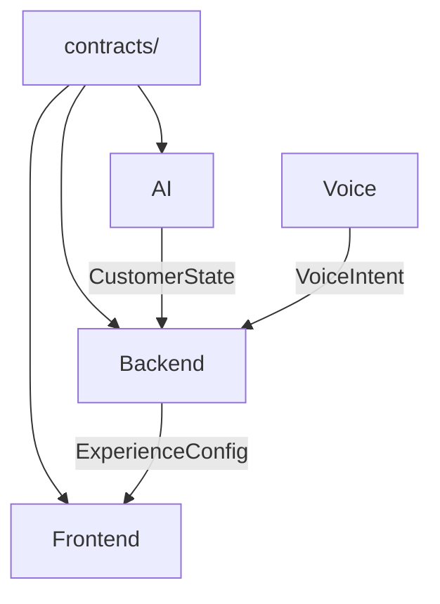
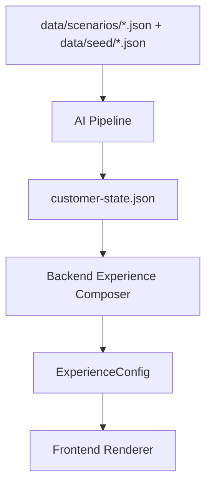

# VZEYA System Architecture

## Core Pipeline

## Voice Pipeline

## What Runs Where
- **Backend Server**: Feature extraction, signal detection, customer state, recommendations, experience composition, API routing
- **On-Device (planned)**: Voice capture, speech-to-text, SLM intent classification, conversational response
- **Frontend (mobile)**: UI rendering from ExperienceConfig, offline state bundles, scenario switching

## Dependency Direction

## Data Flow

## API Architecture
- FastAPI on port 8000
- Endpoints: `GET /customer/{id}`, `GET /experience/{id}`, `POST /scenario/switch`, `POST /voice/intent`
- CORS enabled, health check at `/health`

## Ethical AI Architecture
- Recommendation ranker has `SUPPRESSED_IN_STRESS` categories
- DTI > 0.40 or `stress_alert` triggers suppression
- Every recommendation has a `reason` field

## Contract-Driven Architecture
- Three JSON schemas are the system boundaries
- All domains validate against them
- Changes require multi-party coordination

## Current Limitations
- Voice SLM is rule-based (MiniCPM5 planned)
- No real bank API integration
- Single demo customer
- No auth layer
- No database (in-memory from JSON)
