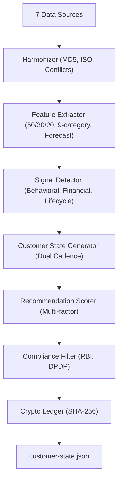
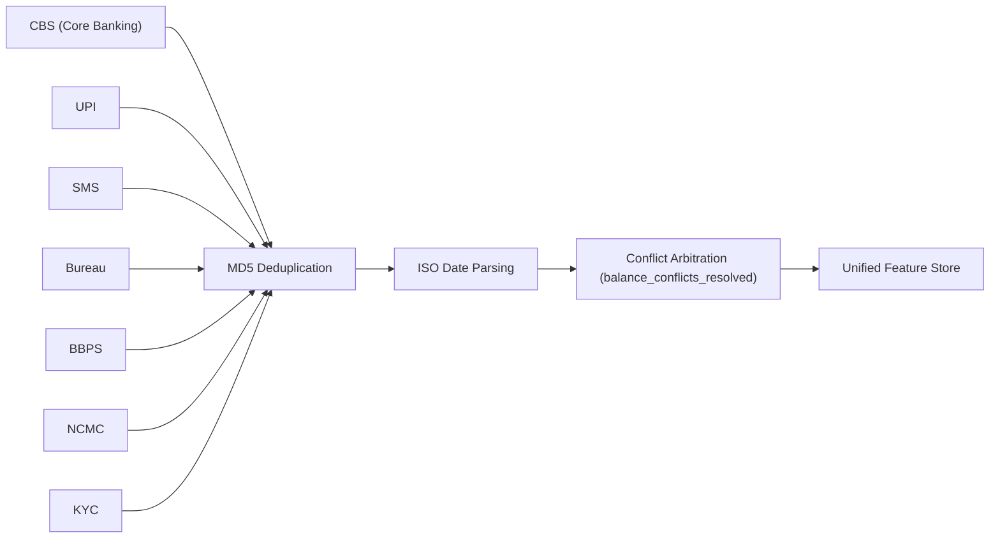
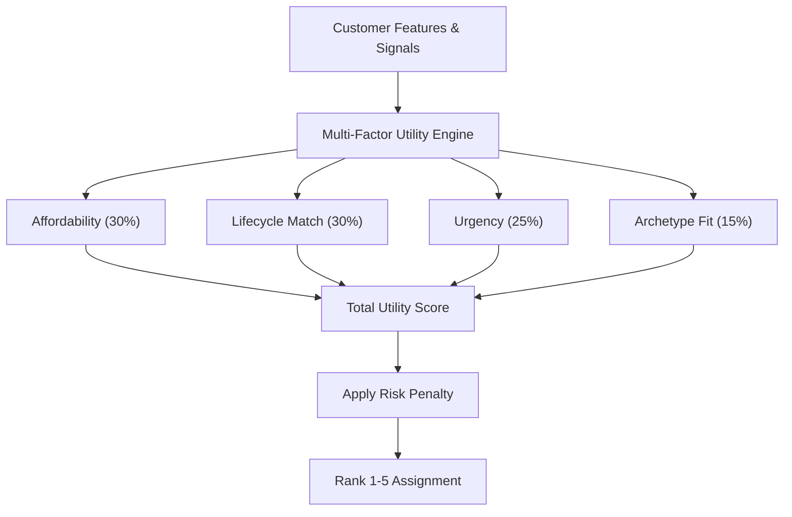
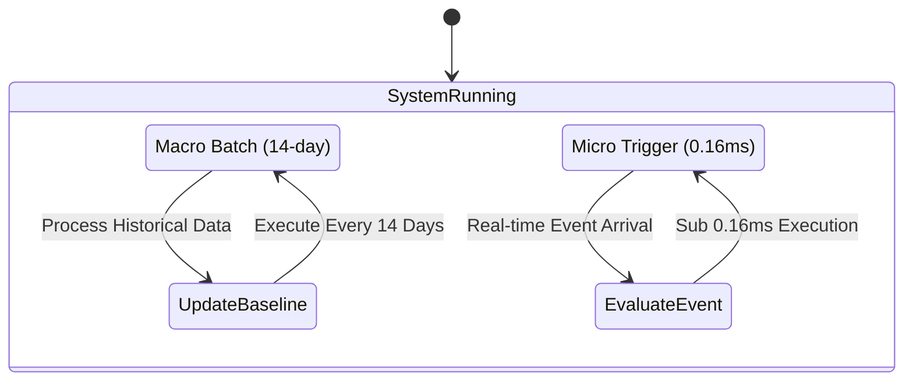
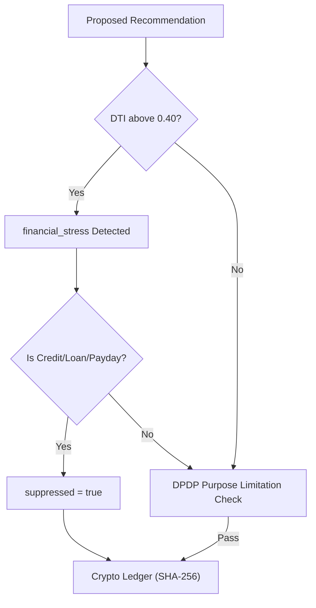
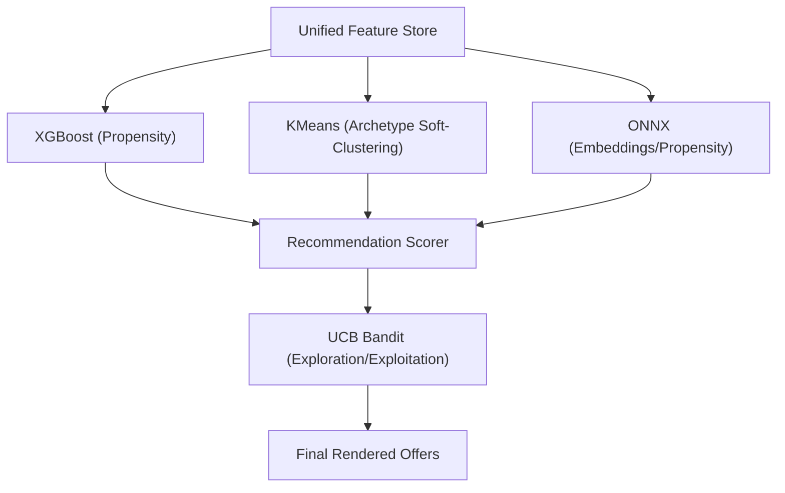
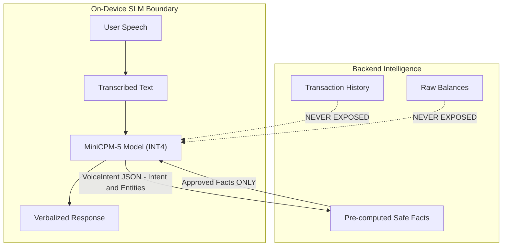
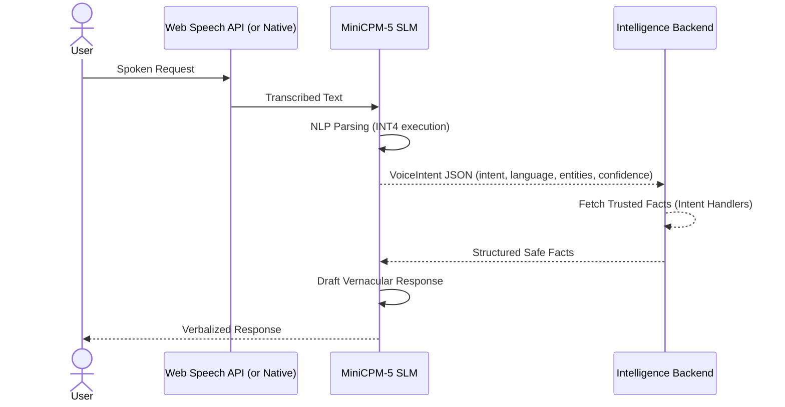

# AI & ML Engine Architecture

This document provides exhaustive engineering-grade documentation for the AI/ML Engine powering the banking application. The AI engine is a Python module located at `ai/` comprising two primary subsystems: **Intelligence** (backend processing, feature extraction, recommendation) and **Voice** (on-device Small Language Model).

---

## 1. Directory Structure & Key Files

The codebase is organized into modular pipelines for deterministic processing and ML inference.

```text
ai/
├── __init__.py
├── [requirements.txt](file:///d:/Vault/dau/ai/requirements.txt)          # pydantic>=2.0, numpy>=1.26, scipy>=1.12, scikit-learn>=1.4, onnxruntime>=1.20
├── [run.py](file:///d:/Vault/dau/ai/run.py)                    # Intelligence entrypoint
├── [run_voice.py](file:///d:/Vault/dau/ai/run_voice.py)              # Voice entrypoint
├── [inspector.html](file:///d:/Vault/dau/ai/inspector.html)            # Live browser dashboard for personalization math
├── [voice_inspector.html](file:///d:/Vault/dau/ai/voice_inspector.html)      # SLM simulator dashboard
├── intelligence/
│   ├── ingestion/            
│   │   ├── [harmonizer.py](file:///d:/Vault/dau/ai/intelligence/ingestion/harmonizer.py)     # MD5 dedup, ISO date parsing, 7-source normalization
│   │   └── [models.py](file:///d:/Vault/dau/ai/intelligence/ingestion/models.py)         # Data source models
│   ├── features/
│   │   ├── [extractor.py](file:///d:/Vault/dau/ai/intelligence/features/extractor.py)      # 50/30/20 rule, 9 category breakdown
│   │   ├── [spend_analyzer.py](file:///d:/Vault/dau/ai/intelligence/features/spend_analyzer.py) # Spending pattern analysis
│   │   ├── [forecaster.py](file:///d:/Vault/dau/ai/intelligence/features/forecaster.py)      # 30-day runway forecast
│   │   └── temporal/trend    
│   ├── signals/
│   │   ├── [detector.py](file:///d:/Vault/dau/ai/intelligence/signals/detector.py)       # Signal classification
│   │   ├── [behavioral.py](file:///d:/Vault/dau/ai/intelligence/signals/behavioral.py)     # Commute, dining, cinema detection
│   │   ├── [financial.py](file:///d:/Vault/dau/ai/intelligence/signals/financial.py)      # DTI, risk, declining savings
│   │   └── [lifecycle.py](file:///d:/Vault/dau/ai/intelligence/signals/lifecycle.py)      # Life-stage changes (medical, marriage)
│   ├── customer_state/
│   │   ├── [generator.py](file:///d:/Vault/dau/ai/intelligence/customer_state/generator.py)      # Dual-cadence: 14-day batch + 0.16ms micro-trigger
│   │   ├── [cadence.py](file:///d:/Vault/dau/ai/intelligence/customer_state/cadence.py)        # Cadence control
│   │   └── [schemas.py](file:///d:/Vault/dau/ai/intelligence/customer_state/schemas.py)        # State schemas
│   ├── personalization/
│   │   ├── [scorer.py](file:///d:/Vault/dau/ai/intelligence/personalization/scorer.py)         # Multi-factor utility scoring
│   │   ├── [compliance.py](file:///d:/Vault/dau/ai/intelligence/personalization/compliance.py)     # RBI DTI caps, DPDP limitations
│   │   └── [cryptoledger.py](file:///d:/Vault/dau/ai/intelligence/personalization/cryptoledger.py)   # SHA-256 tamper-proof decision chain
│   ├── recommendations/
│   │   ├── [rules.py](file:///d:/Vault/dau/ai/intelligence/recommendations/rules.py)          # Recommendation rules
│   │   └── [scoring.py](file:///d:/Vault/dau/ai/intelligence/recommendations/scoring.py)        # Offer ranking + suppression
│   ├── explanations/         # Counterfactual explanations for UI transparency
│   └── ml/                   
│       ├── propensity        # ml_propensity_prob
│       ├── embeddings        # ml_cosine_similarity
│       ├── clustering        # KMeans archetype soft-clustering
│       └── bandit            # ml_bandit_ucb (UCB exploration)
├── voice/
│   ├── model/
│   │   └── [minicpm5_runner.py](file:///d:/Vault/dau/ai/voice/model/minicpm5_runner.py)  # MiniCPM-5 INT4 (~1.85GB RAM, Snapdragon/Apple NPU)
│   ├── inference/            
│   ├── intents/
│   │   ├── [classifier.py](file:///d:/Vault/dau/ai/voice/intents/classifier.py)       # Intent classification
│   │   └── [handlers.py](file:///d:/Vault/dau/ai/voice/intents/handlers.py)         # Intent handlers (PAY_METRO, CHECK_EMI, etc.)
│   ├── prompts/              
│   └── dialogue/             
└── tests/                    
    ├── [test_massive_load.py](file:///d:/Vault/dau/ai/tests/test_massive_load.py)    # 10k transactions under 100ms
    ├── [test_multi_source_ingestion.py](file:///d:/Vault/dau/ai/tests/test_multi_source_ingestion.py) 
    ├── [test_personalization.py](file:///d:/Vault/dau/ai/tests/test_personalization.py) 
    ├── [test_cadence.py](file:///d:/Vault/dau/ai/tests/test_cadence.py)
    ├── [test_cryptoledger.py](file:///d:/Vault/dau/ai/tests/test_cryptoledger.py)
    └── [test_voice_slm.py](file:///d:/Vault/dau/ai/tests/test_voice_slm.py)
```

---

## 2. Intelligence Subsystem

The Intelligence pipeline orchestrates data ingestion from multiple banking and behavioral streams into actionable intelligence.

### 2.1 Intelligence Pipeline

The backend executes a strictly ordered pipeline guaranteeing that raw data is safely and accurately transformed into personalized UI states and product recommendations. 



### 2.2 Data Ingestion & Harmonization

The harmonizer normalizes inputs from up to 7 distinct upstream sources (CBS, UPI, SMS, Bureau, BBPS, NCMC, KYC). Deduplication uses MD5 hashing on transaction properties, and timestamp arbitration normalizes into strict ISO dates. Conflict resolution occurs deterministically via `balance_conflicts_resolved` algorithms.



### 2.3 Feature Extraction & Signal Detection

Data is transformed into actionable metrics:
*   **Feature Extraction:** Utilizes a strict `50/30/20` spending rule breakdown, tracks transactions across 9 major spend categories, and runs a 30-day runway forecast model.
*   **Signal Detection:**
    *   **Behavioral:** Commute, Dining, Cinema routines.
    *   **Financial:** DTI limits, generalized risk, and declining savings.
    *   **Lifecycle:** Medical emergencies, Marriage, major life transitions.

### 2.4 Recommendation Scoring

The scoring engine aggregates multi-factor utility values to identify the exact optimal recommendation for the customer. Offers are assigned ranks from 1-5 based on total scores adjusted by a risk penalty.



> [!NOTE] 
> We utilize 7 specific Bharat Archetypes for localized relevance: `urban_commuter`, `rural_farmer`, `salaried_professional`, `small_business_owner`, `student`, `retired_senior`, `gig_worker`.

### 2.5 Dual Cadence System

The intelligence engine orchestrates execution via a dual-cadence model, combining sweeping batch updates with real-time reactive triggers.



### 2.6 Ethical Compliance Flow

Risk limits heavily guardrail recommendations. If the `financial_stress` detector flags DTI > `0.40`, strict ethical safeguards act to suppress any new credit exposure. All logic executes under the DPDP act limits and binds into an unforgeable Cryptographic Ledger (SHA-256).



### 2.7 ML Model Architecture

Machine Learning features bridge rule-based heuristics with probabilistic insights. All core backend prediction logic executes via tightly scoped ONNX or local models.



---

## 3. Voice & SLM Subsystem

The application features an exclusively on-device vernacular Small Language Model (SLM), based on MiniCPM-5 INT4. It takes roughly 1.85GB of RAM and uses Snapdragon or Apple NPU capabilities natively. Supported vernacular languages include Hindi, Gujarati, Hinglish, and English.

### 3.1 Zero-Leakage Architecture

Security mandates zero exposure of raw transaction histories or granular ledger states to the language model. The architecture achieves this via intent delegation and strict boundary walls.



### 3.2 End-to-End Voice Processing Pipeline

The SLM interprets user intent, delegates state lookups, and translates system-returned facts into natural conversational vernacular.



---

## 4. Quality Assurance & Benchmarks

The entire system validates correctness through strict testing environments covering end-to-end processing speeds, arbitrage resolutions, and ethical controls.
*   **Total Tests**: 45 deterministic tests
*   **Execution Time**: 0.39s total suite execution time
*   **Key Benchmarks**:
    *   [test_massive_load.py](file:///d:/Vault/dau/ai/tests/test_massive_load.py): Validates processing 10k transactions under 100ms.
    *   [test_multi_source_ingestion.py](file:///d:/Vault/dau/ai/tests/test_multi_source_ingestion.py): Asserts logic for SMS vs CBS conflict arbitrage.
    *   [test_personalization.py](file:///d:/Vault/dau/ai/tests/test_personalization.py): Confirms ethical suppression of loans under stress and top 1-to-5 rankings.
    *   [test_cadence.py](file:///d:/Vault/dau/ai/tests/test_cadence.py): Verifies synchronization across macro and micro lifecycles.
    *   [test_cryptoledger.py](file:///d:/Vault/dau/ai/tests/test_cryptoledger.py): Audits the SHA-256 chain integrity loop.
    *   [test_voice_slm.py](file:///d:/Vault/dau/ai/tests/test_voice_slm.py): Mock evaluations for intent mapping from vernacular text.

---

## 5. Development Dashboards

The module ships with two visual development and debugging dashboards:

1.  **Inspector Dashboard (`inspector.html`)**: A browser-based interface to monitor the deterministic math behind personalization logic, audit the cryptographic hash chain, inspect safe-to-spend dials, and track macro/micro cadence timing events.
2.  **Voice Simulator Dashboard (`voice_inspector.html`)**: Simulates the vernacular voice processing cycle, acting as an integration test harness between Text → JSON Intent generation → Backend fact retrieval → Audio Verbalization.
