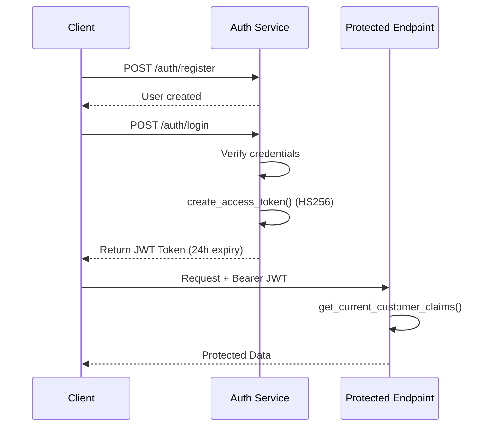
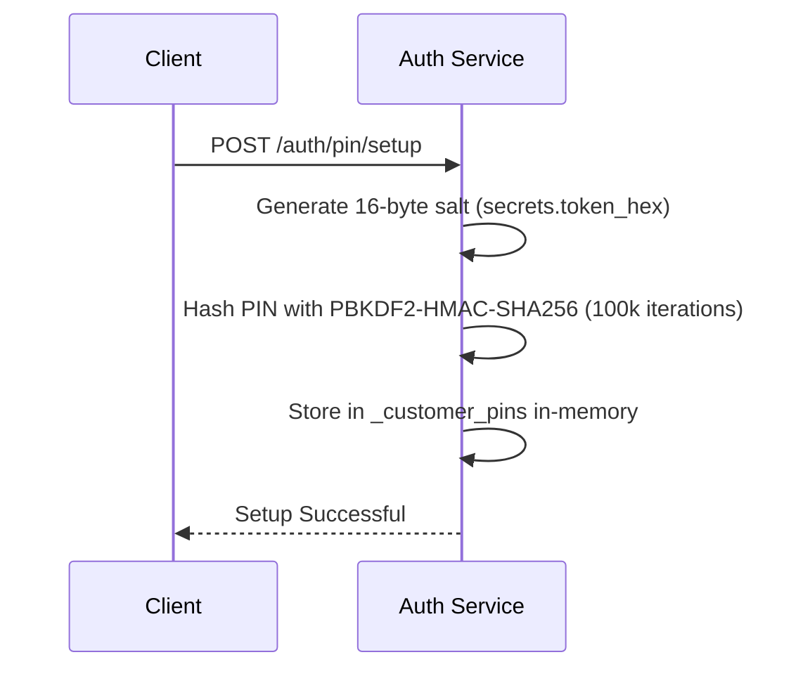
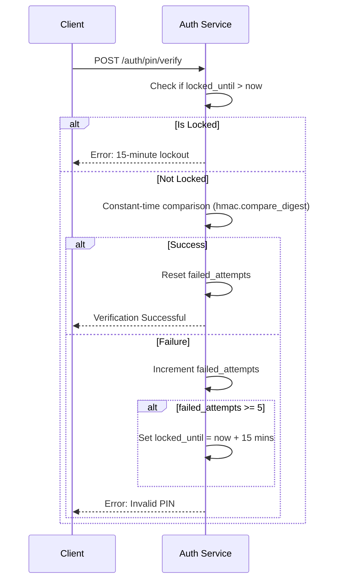
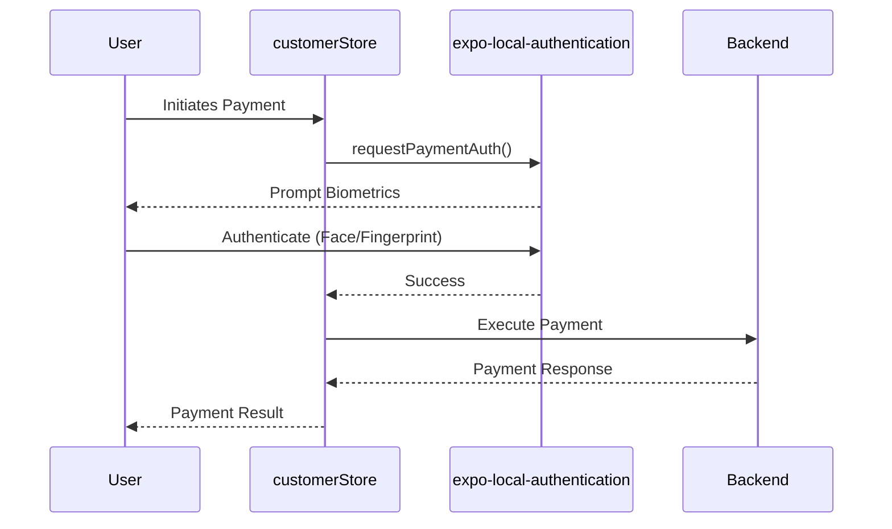
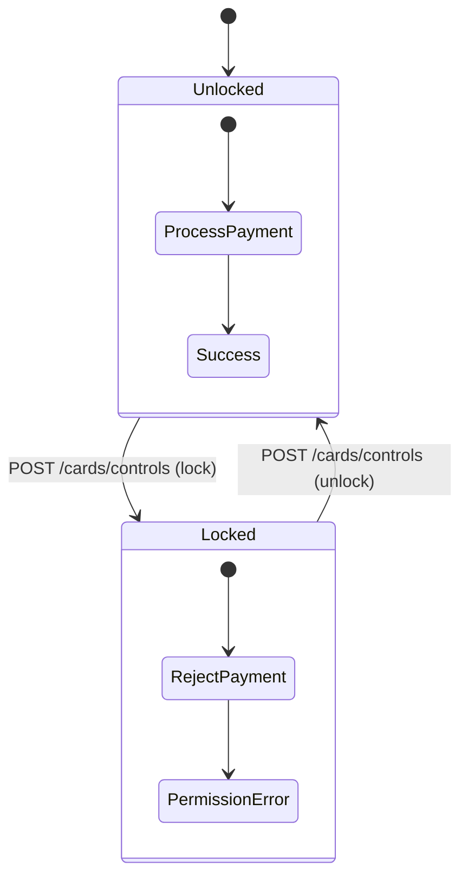
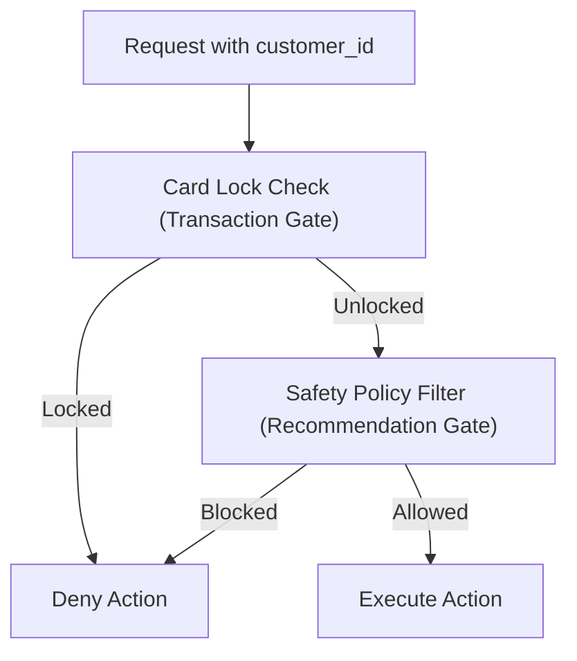

# Authentication and Authorization

This document outlines the authentication and authorization mechanisms for the ABC Bank system.

## Authentication Mechanisms

### 1. JWT Authentication (Backend)
- **Implementation**: Uses `python-jose` for generating and verifying HS256 JWT tokens (see `apps/backend/app/core/auth.py`).
- **Token Generation**: `create_access_token()` issues tokens with a default 24-hour expiration (`ACCESS_TOKEN_EXPIRE_MINUTES`).
- **Protected Routes**: Endpoints like `GET /auth/me` and other protected endpoints depend on `get_current_customer_claims()` which extracts and verifies the bearer token from the `Authorization` header.
- **Routes**: `POST /auth/register` for user creation, `POST /auth/login` to obtain the token.

### 2. PIN Authentication
- **Setup**: `POST /auth/pin/setup` utilizes PBKDF2-HMAC-SHA256 with 100,000 iterations and a 16-byte random salt generated via `secrets.token_hex(16)`.
- **Verify**: `POST /auth/pin/verify` uses `hmac.compare_digest` for a constant-time comparison to prevent timing attacks.
- **Brute Force Protection**: 5 failed attempts result in a 15-minute lockout.
- **Storage**: PIN data is stored in an in-memory dictionary `_customer_pins` containing `{hash, salt, failed_attempts, locked_until}`.

### 3. Biometric Authentication (Frontend)
- Utilizes `expo-local-authentication` for device biometrics.
- The `requestPaymentAuth()` function in the `customerStore` is triggered before sensitive operations.
- Falls back to PIN authentication if biometrics are unavailable or fail.

### 4. Card Security
- The `_card_controls` mechanism manages the `is_locked` state per customer.
- If a card is locked, `execute_payment` raises a `PermissionError` for ATM, POS, and Card categories.
- `POST /cards/controls` is used to update the lock status and limits.

## Authorization

- **JWT Claims**: The system relies on JWT tokens validated via `get_current_customer_claims()` for secure authorization to endpoints.
- **Transaction Gate**: The card lock acts as a transaction-level authorization gate.
- **Recommendation Gate**: The `SafetyPolicyFilter` acts as a recommendation-level authorization (e.g., blocking credit recommendations for users in a stressed financial state).

## Security Limitations

- **CORS**: Configured with `allow_origins=["*"]`, which is suitable only for development.
- **Ephemeral Storage**: PIN state is stored in-memory and will be lost upon application restart.
- **HTTPS Enforcement**: No HTTPS enforcement at the application level; relies entirely on external infrastructure.

## Diagrams

### JWT Authentication Flow

### PIN Setup Flow

### PIN Verification with Rate Limiting

### Biometric Payment Flow

### Card Security State

### Authorization Layers

