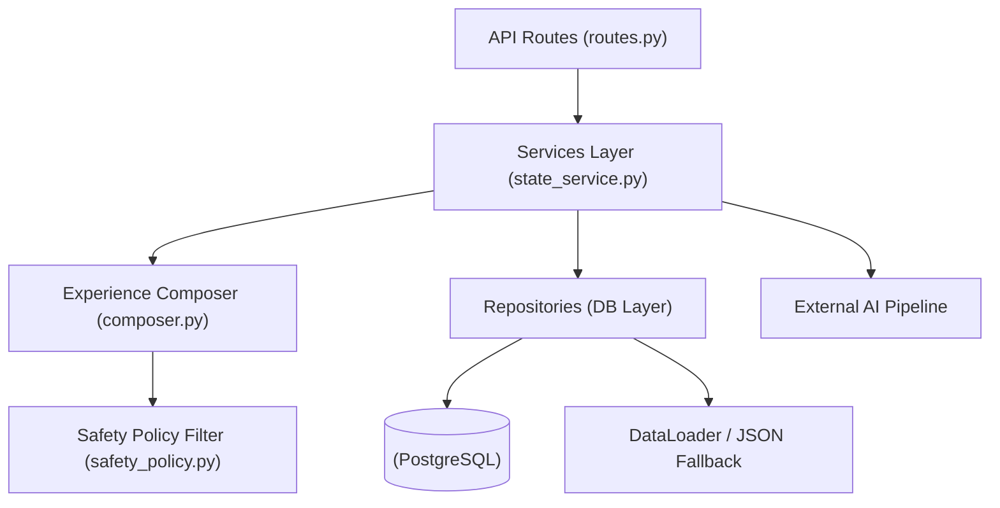
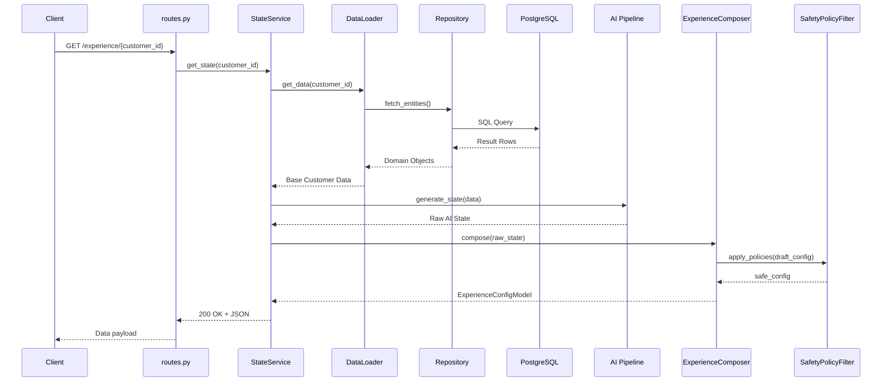
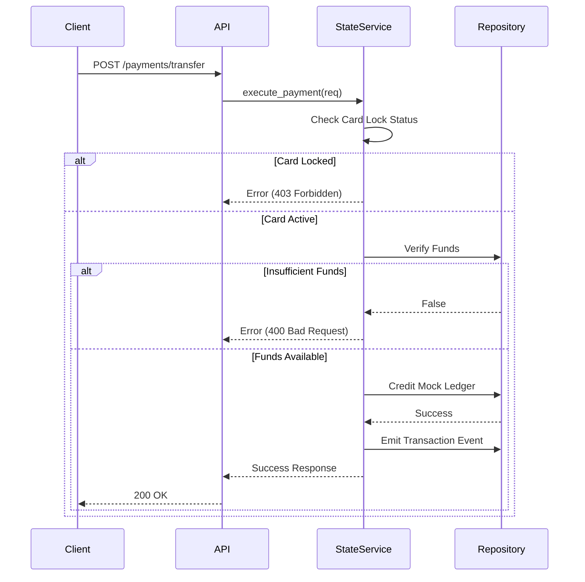
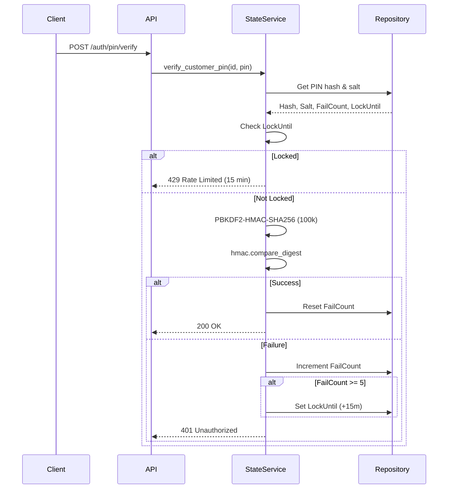
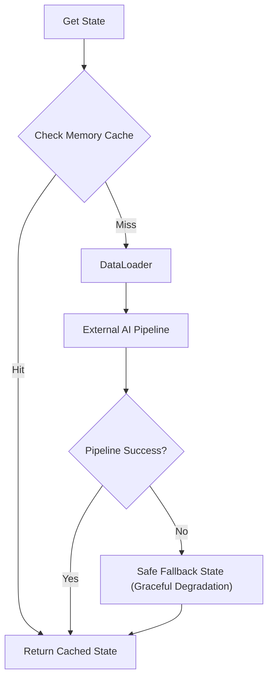
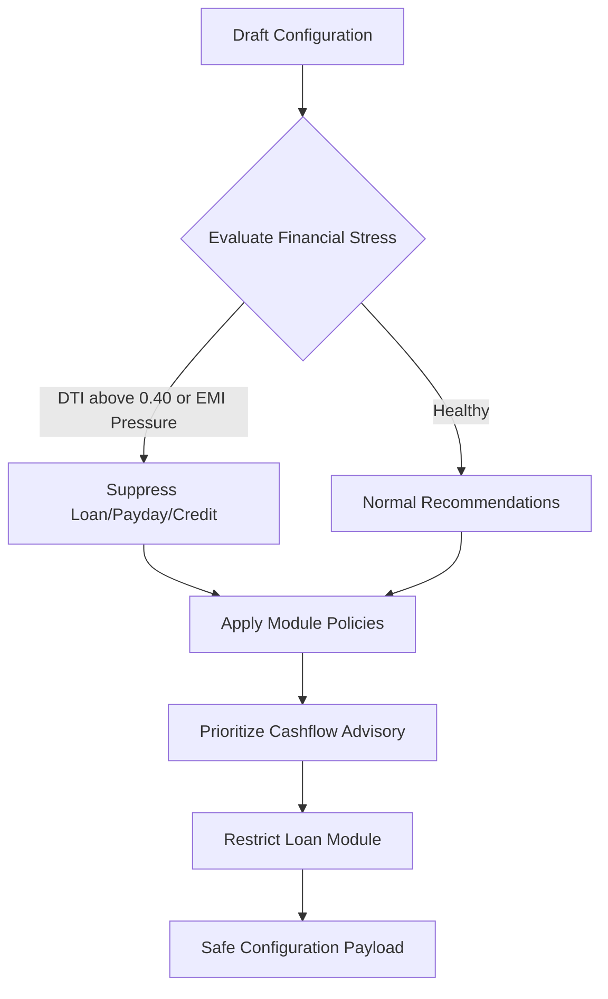
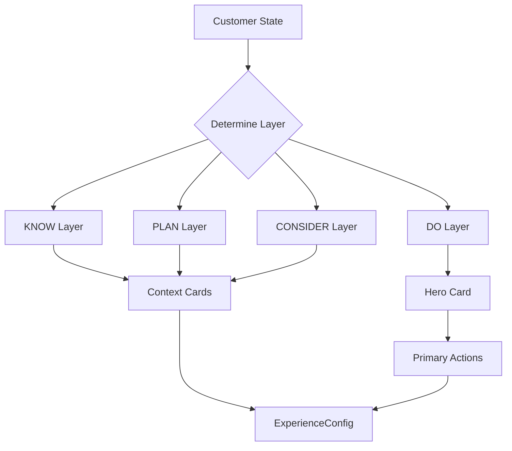

# Backend Architecture Documentation

The backend is a FastAPI Python application located at `apps/backend/`. It acts as the core orchestration layer for the ABC-Bank experience, managing data retrieval, calling the AI pipeline, composing the user experience, and enforcing safety and behavioral policies.

## 📁 Directory Structure

```text
apps/backend/
├── requirements.txt
├── app/
│   ├── main.py              # FastAPI app init, CORS, router mount
│   ├── api/routes.py        # All REST endpoints
│   ├── core/
│   │   └── auth.py          # JWT Authentication layer
│   ├── db/
│   │   ├── session.py       # SQLAlchemy connection (auto WSL IP detection)
│   │   ├── models.py        # ORM models
│   │   ├── loader.py        # DataLoader (DB → JSON fallback)
│   │   ├── alembic/         # Migration files
│   │   └── repositories/
│   │       ├── customer_repo.py
│   │       ├── transaction_repo.py
│   │       └── event_and_product_repo.py
│   ├── experience/
│   │   └── composer.py      # ExperienceComposer (state → UI config)
│   ├── models/              # Pydantic schemas
│   │   ├── customer_state.py
│   │   ├── experience.py
│   │   ├── assistant.py
│   │   ├── events.py
│   │   └── voice.py
│   └── services/
│       ├── state_service.py   # Core orchestrator
│       ├── safety_policy.py   # Anti-predatory lending filter
│       └── behavior_engine.py # Contextual habit analyzer
```

---

## 🏗️ Backend Layer Architecture



---

## 📡 API Endpoints

All endpoints are prefixed with `/api/v1`.

| Method | Path | Purpose |
|--------|------|---------|
| `GET`  | `/customer/{customer_id}` | Returns CustomerStateModel |
| `GET`  | `/experience/{customer_id}` | Returns ExperienceConfigModel |
| `POST` | `/scenario/switch` | Switch demo scenario |
| `POST` | `/events` | Generic event ingestion |
| `POST` | `/assistant/intent` | Secure intent execution |
| `POST` | `/voice/intent` | Legacy voice classifier |
| `GET`  | `/assistant/init` | Mitra chat initializer |
| `POST` | `/assistant/chat` | Mitra conversational endpoint |
| `POST` | `/auth/pin/setup` | Cryptographic PIN creation |
| `POST` | `/auth/pin/verify` | PIN verification |
| `GET`  | `/cards/{customer_id}` | Card states |
| `POST` | `/cards/controls` | Card lock/limit updates |
| `GET`  | `/transactions/{customer_id}`| Combined runtime + historic txns |
| `POST` | `/payments/transfer` | Money transfer |
| `POST` | `/loans/disburse` | Instant credit disbursement |

*Root endpoints include `/health`, `/inspector`, and `/voice-inspector`.*

---

## ⚙️ Core Services Detail

### StateService ([state_service.py](file:///d:/Vault/dau/apps/backend/app/services/state_service.py))
The core orchestrator responsible for managing application state and routing actions.
- **`get_state()`**: Checks memory cache; falls back to DataLoader, then triggers the AI pipeline. Falls back to a safe generic state if pipeline fails.
- **`switch_scenario()`**: Flushes the memory cache and switches context.
- **`ingest_event()`**: Updates balances, tracks metadata, and embeds recommendation overrides.
- **Auth**: `set_customer_pin()` and `verify_customer_pin()` handle PBKDF2-HMAC-SHA256 based authentication. JWT Auth is managed via `register_customer` and `authenticate_customer` in `core/auth.py`.
- **Transactions**: `execute_payment()` checks card locks and funds before crediting the mock ledger.
- **Credit**: `disburse_loan()` offers up to ₹1,50,000 in instant credit.
- **Relief Services**: `request_emi_grace()` (10-day buffer), `split_emi()` (50/50 split), `sweep_deficit_for_emi()` (auto-sweep shortfall), `cancel_loan_cooling_off()` (3-day RBI cancellation).
- **Other utilities**: `submit_kyc()`, `submit_medical_claim()`, `pause_mandate()`.

### SafetyPolicyFilter ([safety_policy.py](file:///d:/Vault/dau/apps/backend/app/services/safety_policy.py))
Guards against predatory lending and over-indebtedness.
- **`evaluate_financial_stress()`**: Checks if Debt-To-Income (DTI) ratio > 0.40 or if there is critical EMI pressure.
- **`filter_recommendations()`**: Suppresses loan, payday, or high-credit limit suggestions for stressed customers.
- **`apply_module_policies()`**: Restricts the loan module and aggressively prioritizes cashflow advisory.

### BehavioralEngine ([behavior_engine.py](file:///d:/Vault/dau/apps/backend/app/services/behavior_engine.py))
Provides contextual, time-aware enhancements.
- **`analyze_habits()`**: Maps recurring transactions into daily/weekly schemas.
- **`evaluate_current_relevance()`**: Uses `datetime.now()` to insert contextual hints (e.g., prompting a commute pass between Mon-Fri 07:45-09:30).

### ExperienceComposer ([composer.py](file:///d:/Vault/dau/apps/backend/app/experience/composer.py))
Translates raw state into a UI configuration payload.
- **`compose()`**: Takes customer state + AI recommendations and builds an `ExperienceConfigModel`.
- **`_determine_layer()`**: Routes items to `DO`, `KNOW`, `PLAN`, or `CONSIDER` layers based on priority.

### JWT Authentication Layer ([core/auth.py](file:///d:/Vault/dau/apps/backend/app/core/auth.py))
Provides stateless, secure token-based authentication.
- **`create_access_token()`**: Encodes customer identity, expiration (60 minutes), and custom claims into a secure JWT using `PyJWT`.
- **`get_current_customer_claims()`**: Dependency injection method to decode JWTs, verify signature (`SECRET_KEY`), check expiration, and extract claims for protected routes like `/auth/me`.
- **`verify_password()` & `get_password_hash()`**: Utilizes `passlib` (bcrypt) for robust one-way password hashing during registration and login.

---

## 🗄️ Database Layer

- **Tech Stack**: SQLAlchemy ORM with Alembic for migrations.
- **DataLoader**: Uses PostgreSQL repositories primarily. If offline, gracefully falls back to reading JSON seed data from `data/seed/` and `data/scenarios/`.
- **Connection ([session.py](file:///d:/Vault/dau/apps/backend/app/db/session.py))**: Auto-detects WSL IPv4 addressing via PowerShell `Get-NetNeighbor` to bridge Docker/WSL networking reliably, falling back to localhost.
- **Repositories**: Standard repository pattern implemented for `CustomerRepository`, `TransactionRepository`, `EventRepository`, and `ProductRepository`.

---

## 🔒 Security

- **PIN Storage**: Cryptographically secure using `PBKDF2-HMAC-SHA256` (100,000 iterations), 16-byte random salt, and constant-time `hmac.compare_digest`.
- **Rate Limiting**: Brute-force protection allows 5 failed PIN attempts before a 15-minute freeze lockout.
- **Card Controls**: The `is_locked` flag at the repository level immediately blocks ATM, POS, and Card payments.
- **CORS**: `allow_origins=["*"]` configured for rapid development/demo mode.
- **Responsible AI**: `SafetyPolicyFilter` forcefully drops debt-incurring recommendations for users in distress.

---

## ⚠️ Error Handling

- **Graceful Degradation**: If the external AI pipeline or PostgreSQL DB crashes, `_create_safe_fallback_state` generates a generic valid profile to ensure the UI still renders.
- **HTTPException Mapping**:
  - `ValueError` → 400 Bad Request
  - `KeyError` → 404 Not Found
  - `PermissionError` → 403 Forbidden
- **Validation**: Strict validation using Pydantic (`BaseModel` + `Field`) and regex for sensitive fields like PAN/Aadhaar.

---

## 🔌 External Integrations

- **AI Pipeline**: Tightly coupled with the `ai.` namespace (e.g., `ai.intelligence.features.extractor`, `ai.intelligence.customer_state.generator`, `ai.voice.intents.classifier`).
- **Mocks**: Third-party integrations such as TPA gateways (medical claims) and credit bureaus (CIBIL) are currently mocked.

---

## 📊 Detailed System Flows

### 1. Request Lifecycle


### 2. Payment Flow


### 3. PIN Authentication


### 4. State Resolution


### 5. Safety Policy Filter


### 6. Experience Composition

