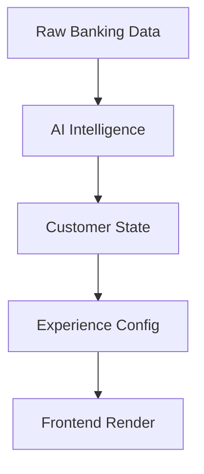
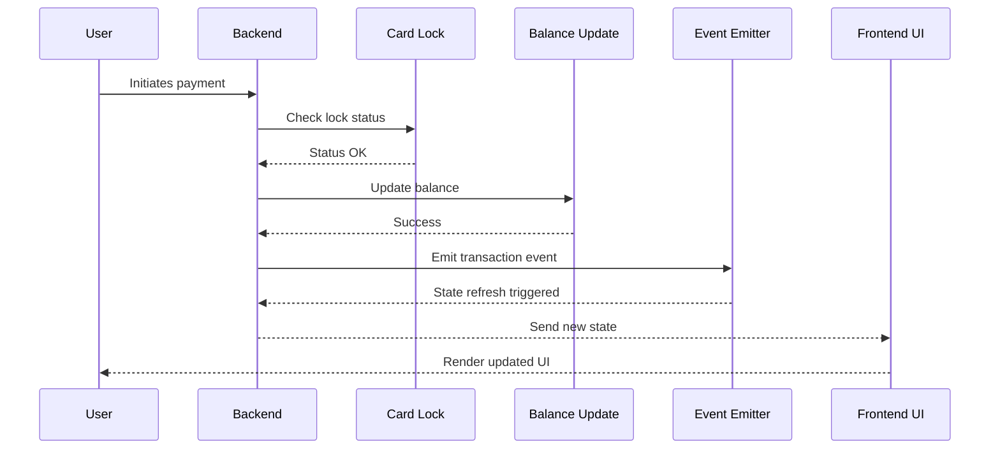
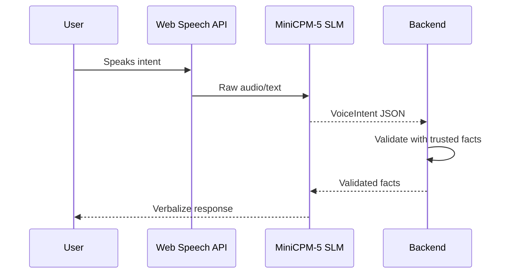
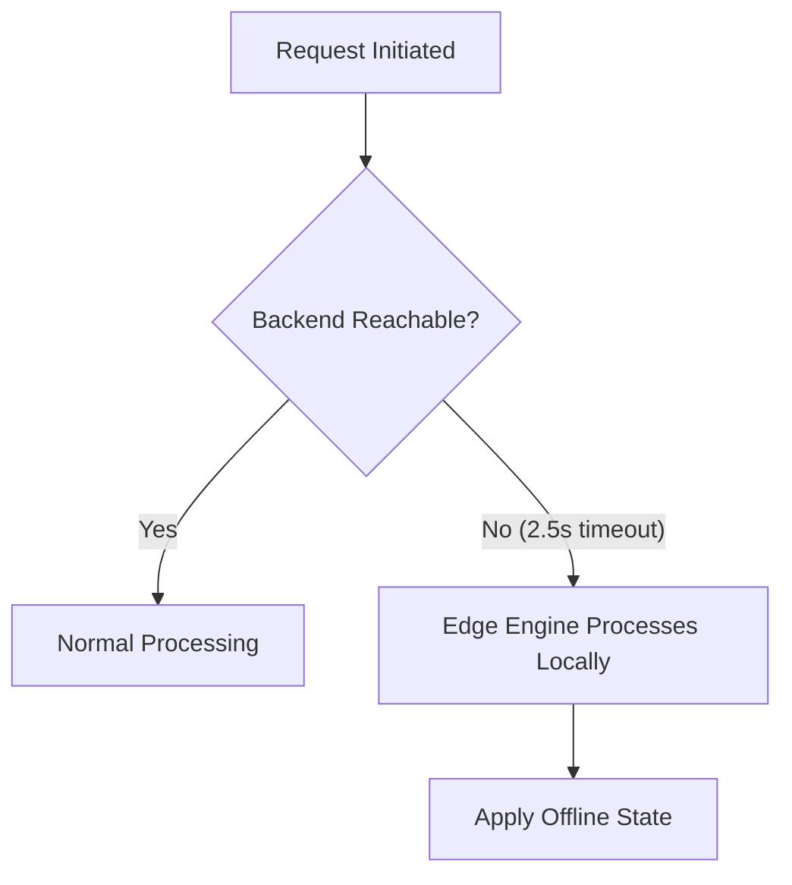
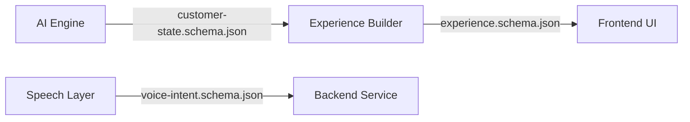
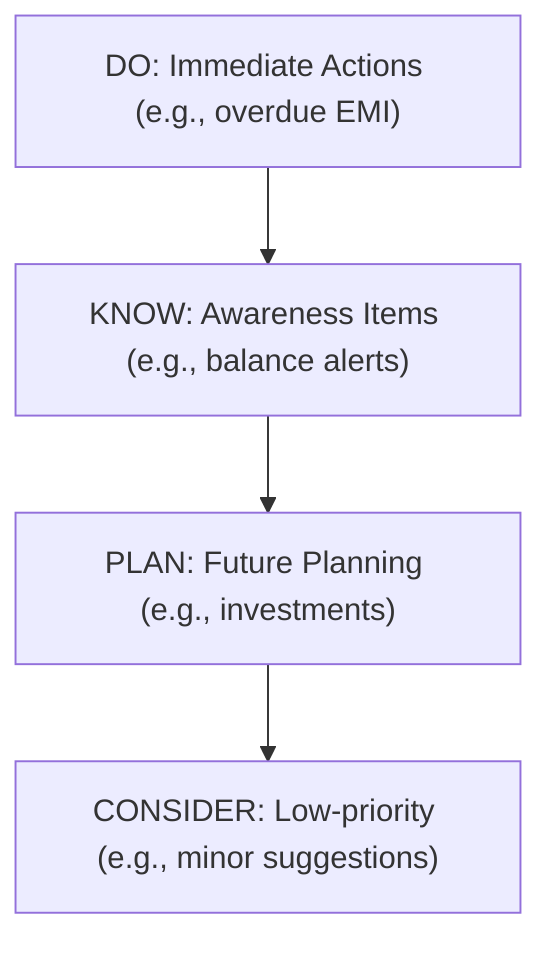

# Data Flow Architecture

This document outlines the comprehensive data flow architecture for the VZEYA / ABC Bank system.

## Key Data Flows

### 1. End-to-End Personalization Flow
Raw banking data is processed by the AI Intelligence engine to generate a Customer State. This state is transformed into an Experience Config, which the frontend renders.

### 2. Transaction Processing
The flow follows a strict sequence:
1. User initiates payment.
2. Backend validates the request.
3. System checks for card lock status.
4. Balance is updated upon validation.
5. Event emission triggers a state refresh.
6. The updated state is sent to the frontend for UI update.

### 3. Scenario Switching
When a demo switches context:
1. Memory is flushed.
2. AI Intelligence is re-evaluated.
3. A new customer state is generated.
4. A new experience is configured and sent to the frontend for re-rendering.

### 4. Voice Intent Flow
1. User speaks, captured by the Web Speech API.
2. The MiniCPM-5 SLM processes the audio and generates a VoiceIntent JSON.
3. The backend validates against trusted facts.
4. The SLM verbalizes the validated response, and the user hears it.

### 5. Event Ingestion
External banking events are processed via a POST to `/events`. This can result in a balance adjustment or a recommendation override, eventually triggering a state update.

### 6. Loan Disbursement
1. User requests a loan.
2. Backend validates the request (max ₹1,50,000).
3. If valid, the balance is credited.
4. An event is emitted, leading to a state refresh.

### 7. Offline Fallback
If the backend is unreachable (2.5s timeout), the edge engine processes the request locally and applies an offline state.

### 8. Database Fallback
If PostgreSQL is unreachable, the DataLoader detects the failure and falls back to JSON seed files.

## Contract Schemas

- **customer-state.schema.json**: Contains `financial_health` (thriving/stable/tight/stress), `signals`, and `recommendations` (with a `suppressed` flag).
- **experience.schema.json**: Defines the `hero_card`, `context_cards` (organized into DO/KNOW/PLAN/CONSIDER layers), `primary_actions`, and `deprioritized_modules`.
- **voice-intent.schema.json**: Contains `intent`, `language`, `entities`, `response_text`, and `confidence`.

## Attention Layer System

The system organizes context cards into four priority layers:
- **DO**: Immediate actions (e.g., overdue EMI, locked card).
- **KNOW**: Awareness items (e.g., spending patterns, balance alerts).
- **PLAN**: Future planning (e.g., investments, insurance).
- **CONSIDER**: Low-priority suggestions.

## Diagrams

### Complete Data Flow

### Transaction Sequence

### Voice Intent Sequence

### Offline Fallback Flow

### Contract Interface Map

### Attention Layer Priority

