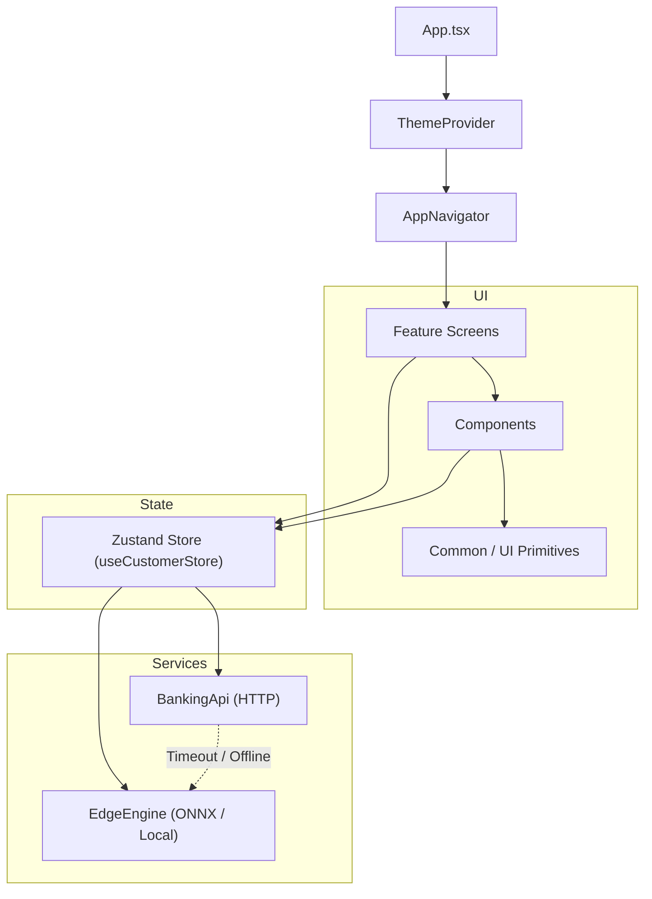
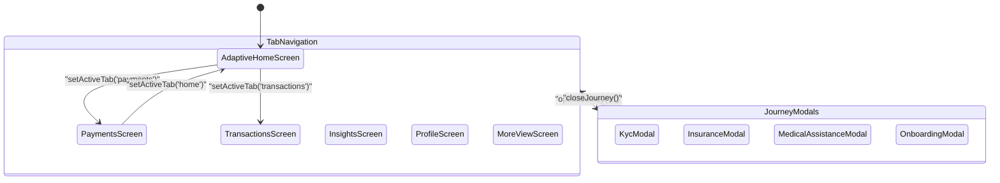
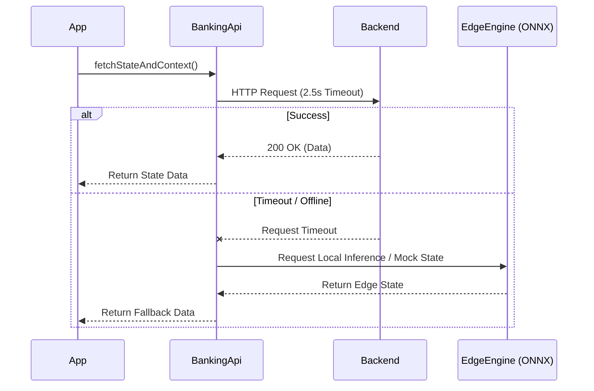
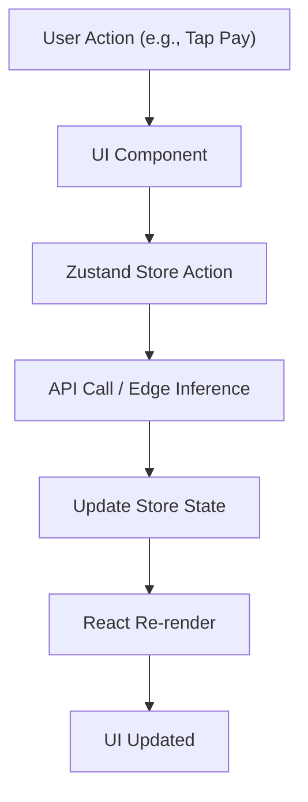
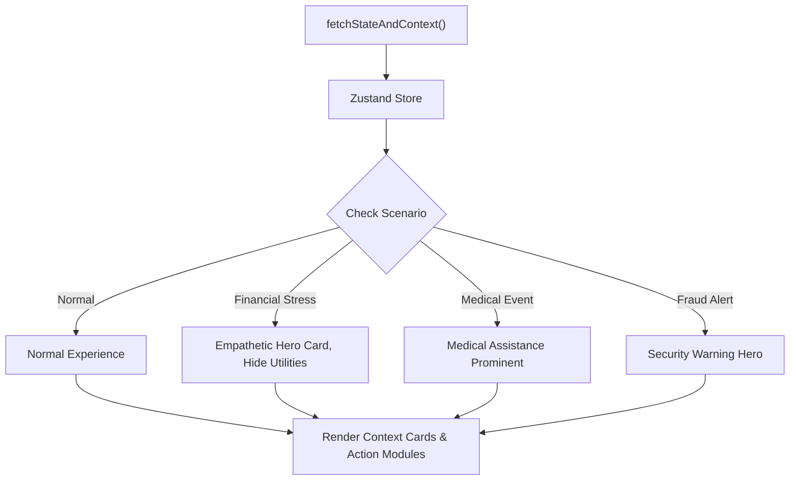
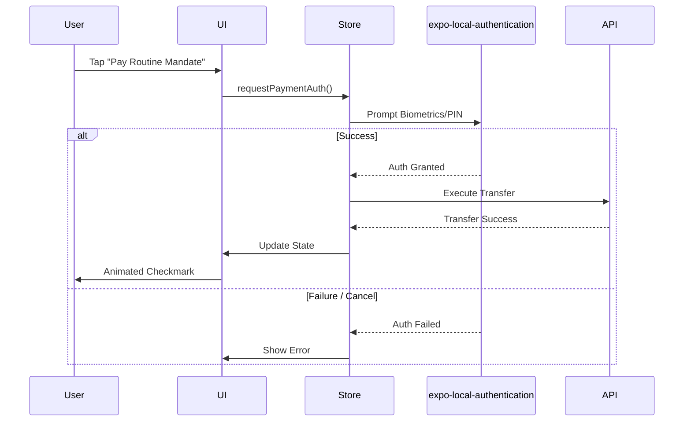
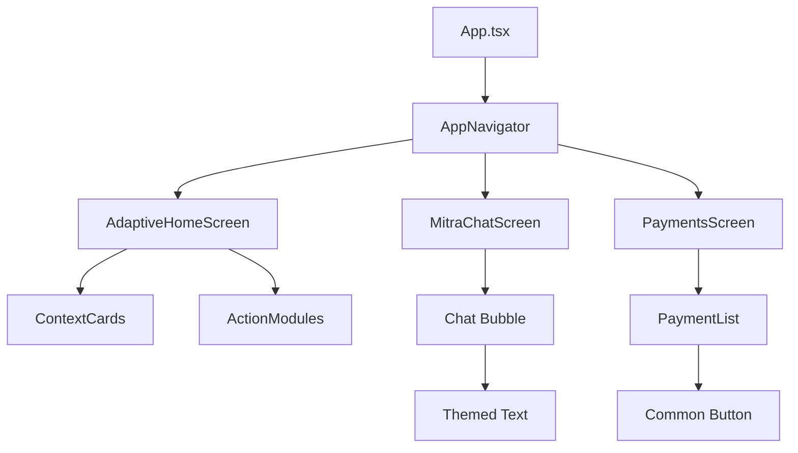

# Frontend Architecture

This document provides a comprehensive overview of the frontend architecture for the Neutron-0/ABC-Bank mobile application. The frontend is built using React Native and Expo, emphasizing on-device machine learning, dynamic adaptive interfaces, and high performance without relying on heavy third-party UI libraries.

## 1. Framework & Versions

- **Expo:** ^57.0.22
- **React:** 19.2.3
- **React Native:** 0.86.3
- **UI Framework:** Pure React Native primitives (No third-party UI component libraries)
- **Icons:** `lucide-react-native` (SVG-based)
- **State Management:** `zustand` ^5.0.15
- **On-Device ML:** `onnxruntime-react-native`
- **Biometrics:** `expo-local-authentication`
- **Secure Storage:** `expo-secure-store`

## 2. Directory Structure

The source code is organized by feature modules to ensure encapsulation and scalability.

```text
apps/frontend/
├── assets/                  # Icons, fonts, ML models (minicpm5_slm_v1.onnx)
├── src/
│   ├── components/          # Reusable UI components
│   │   ├── common/
│   │   ├── context/
│   │   ├── payments/
│   │   └── transactions/
│   ├── features/            # Screen-level feature modules
│   │   ├── assistant/       # MitraChatScreen
│   │   ├── demo/            # PrototypeLabModal, ArchitectureFlowModal
│   │   ├── home/            # AdaptiveHomeScreen
│   │   ├── insights/        # InsightsScreen
│   │   ├── journeys/        # KycModal, InsuranceModal, MedicalAssistanceModal, etc.
│   │   ├── more/            # MoreViewScreen
│   │   ├── onboarding/      # OnboardingModal
│   │   ├── payments/        # PaymentsScreen
│   │   ├── profile/         # ProfileScreen
│   │   └── transactions/    # TransactionsScreen
│   ├── i18n/                # Localization (en, hi, gu)
│   ├── motion/              # Custom animations and gestures
│   ├── navigation/          # Custom router (AppNavigator.tsx)
│   ├── services/            # API client + edge AI
│   ├── state/               # Zustand store (customerStore.ts)
│   ├── theme/               # ThemeProvider, tokens, fonts, colors
│   └── types/               # TypeScript interfaces
├── App.tsx                  # Entry point
├── app.json                 # Expo config
└── package.json
```

## 3. Architecture Diagrams

### 3.1 Frontend Architecture

This diagram illustrates the high-level architecture, showing how the root application initializes the theme and navigation, and how screens interact with the central state and external services.



### 3.2 Screen Navigation Flow

The application uses a custom-built router. Navigation is state-driven via Zustand, with overlay modals for specific user journeys.



### 3.3 Data Fetching & Fallback Mechanism

The API client includes a robust fallback mechanism. If the backend is unreachable or times out, the app seamlessly falls back to on-device processing.



### 3.4 State Management Flow

Zustand provides a monolithic store that dictates the UI state. State changes trigger re-renders and potentially side effects like API calls.



### 3.5 Adaptive Home Screen

The `AdaptiveHomeScreen` morphs its layout and content based on the user's detected financial or life state (e.g., normal, stress, medical event).



### 3.6 Payment Authentication Flow

Sensitive actions utilize `expo-local-authentication` to verify the user via biometrics or PIN before proceeding with the transaction.



### 3.7 Component Hierarchy

The application strictly separates layout structures from reusable components.



## 4. State Management (Zustand)

The app utilizes a monolithic Zustand store located at `src/state/customerStore.ts`.
- **Primary Hook:** `useCustomerStore`
- **Managed State:** `activeTab`, `activeJourney` (overlay modals), user profile, account balances, transactions, and UI toggles (e.g., `isBalanceHidden`).
- **Simulated States:** Supports switching between scenarios for demo purposes: `normal`, `surplus`, `financial_stress`, `medical_event`, `fraud_alert`.
- **Data Initialization:** `fetchStateAndContext()` acts as the primary data loading action.

## 5. Navigation Architecture

Unlike traditional React Native apps that use `react-navigation`, this app implements a custom-built router in `src/navigation/AppNavigator.tsx`.
- **State-Driven:** Navigation state is maintained entirely within Zustand. Calling `setActiveTab('payments')` updates the state, causing the router to render the corresponding screen.
- **Cross-Feature Journeys:** `openJourney('journey_id', payload)` opens modal overlays that sit on top of the tab navigation.
- **Transitions:** Screen transitions use React Native's `Animated` APIs to provide cross-fades and directional slides based on the tab order index.

## 6. API Client

The application interacts with backend services via the `BankingApi` static class in `src/services/api.ts`.
- **Transport:** Native `fetch` utilizing an `AbortController` with a strict 2.5s timeout.
- **Resiliency:** If the backend is slow or unreachable, it falls back to offline/on-device processing.
- **Environment:** Configured via `EXPO_PUBLIC_API_URL`, falling back to `10.0.2.2:8000` (Android) or `localhost:8000` (iOS/Web).

## 7. On-Device AI

To guarantee ultra-low latency and privacy, the app leverages edge ML models.
- **Engine:** `MiniCPM5EdgeEngine.ts` runs rule-based zero-latency NLP intent classification on-device.
- **Service:** `onDeviceIntentService.ts` maps user text to intents like `PAY_METRO`, `CHECK_EMI`.
- **Model:** The ONNX model is bundled within the app at `assets/minicpm5_slm_v1.onnx`.
- **Performance:** Provides 0ms latency fallback when the backend is unreachable.

## 8. Authentication

Security for sensitive operations is handled via device-level authentication.
- **Library:** `expo-local-authentication`
- **Flow:** `requestPaymentAuth()` in `customerStore` triggers a device biometric or PIN prompt. This is mandatory before sensitive actions such as payments or transfers.

## 9. Theming and Localization

- **Theming:** A custom `useAppTheme` hook from `src/theme/ThemeContext.tsx` provides dynamic colors, radii, spacing, and typography. All styling is achieved via `StyleSheet.create`.
- **Localization:** Handled by `src/i18n/index.ts`. The `getTranslation(language)` function supports English (`en`), Hindi (`hi`), and Gujarati (`gu`), enabling dynamic language switching at runtime.

## 10. Key Screens & User Flows

1. **AdaptiveHomeScreen:** A dynamic dashboard that morphs based on the financial state. In stress, it hides utility widgets and shows an empathetic hero card. In a medical event, it displays Medical Assistance prominently.
2. **MitraChatScreen:** Provides AI chat capabilities with structured replies, action chips, and deep-link navigation routing.
3. **1-Tap Payment:** The user taps a routine mandate, which invokes `requestPaymentAuth()`. Upon successful biometric verification, the store updates, and an animated checkmark is displayed—all without leaving the screen.
4. **Scenario Switching:** A dedicated demo feature allows toggling between normal, stress, medical, and fraud states to showcase the adaptive UI.

## 11. Types & Interfaces

Type definitions are centrally located in `src/types/index.ts`. Key interfaces include:
- `CustomerProfile`
- `AccountBalance`
- `Transaction`
- `LifeStageSignals`
- `ContextCard`
