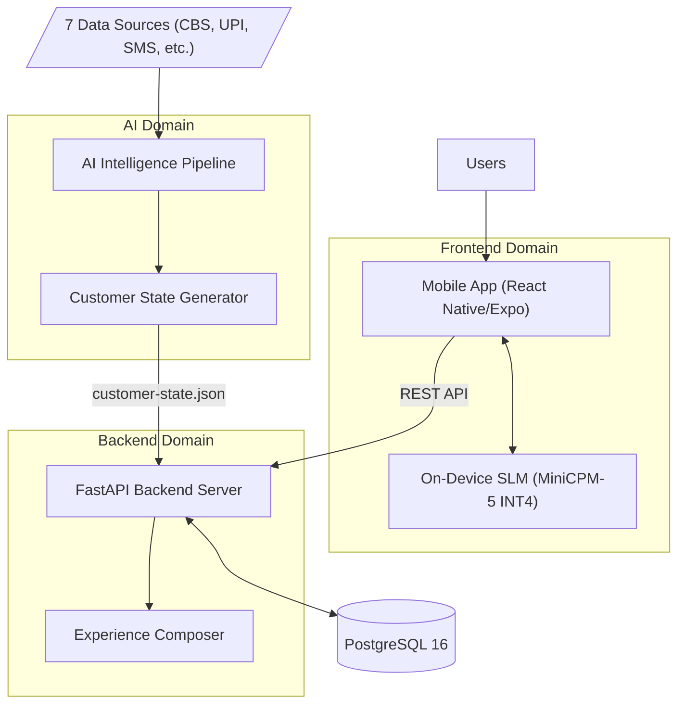
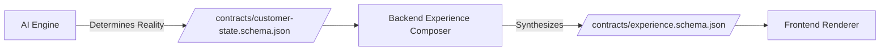
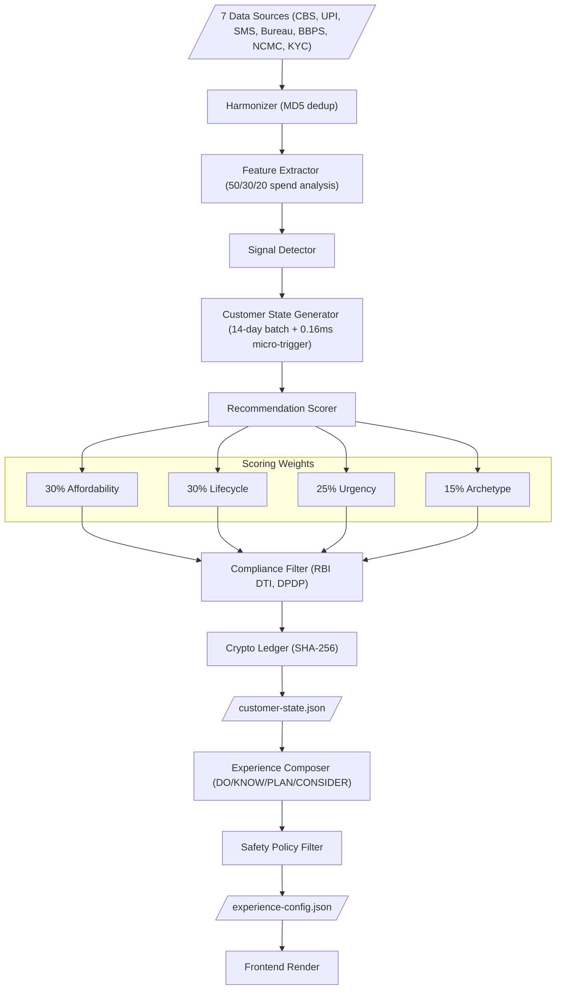
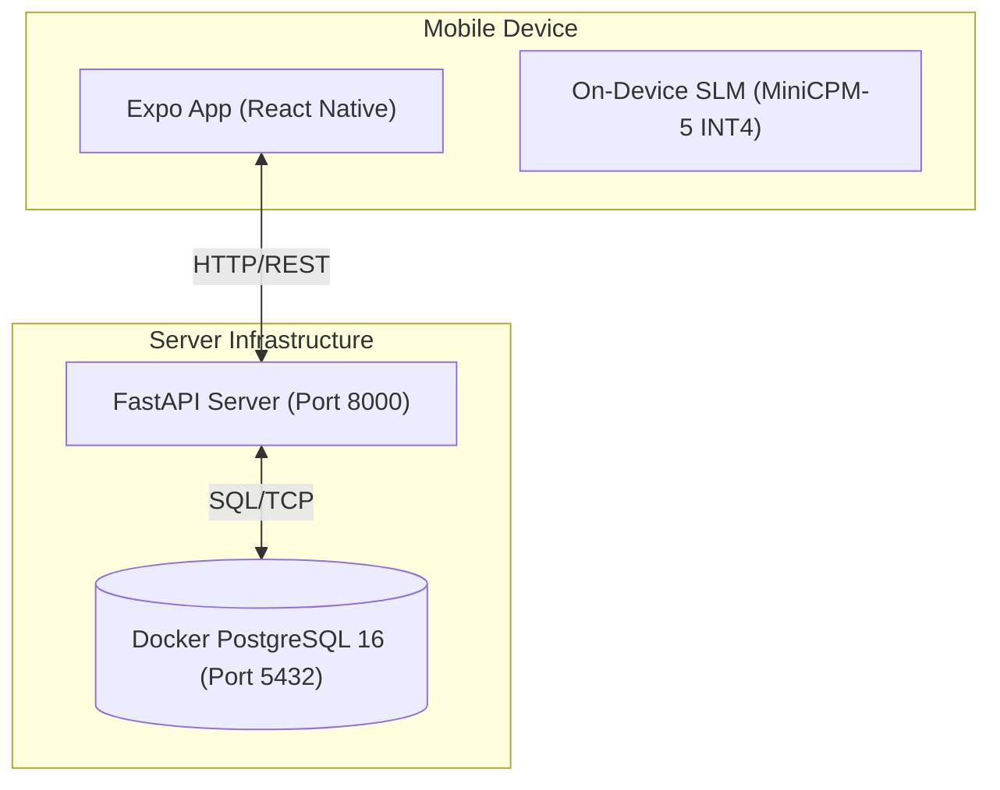
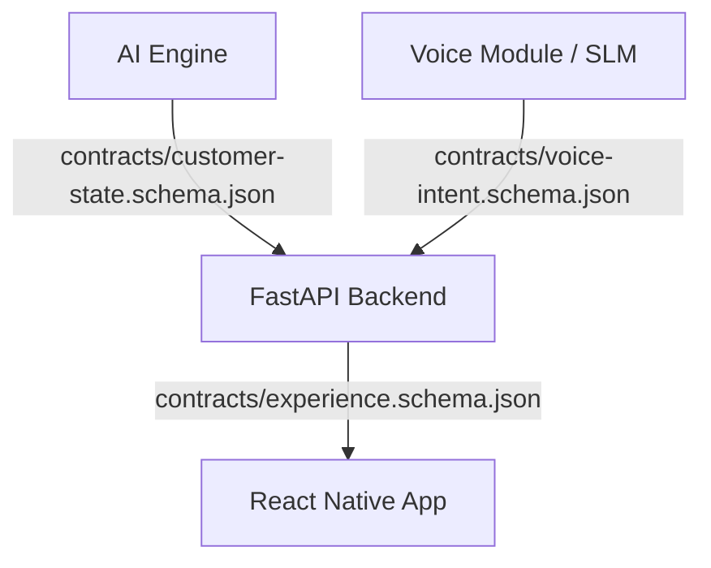
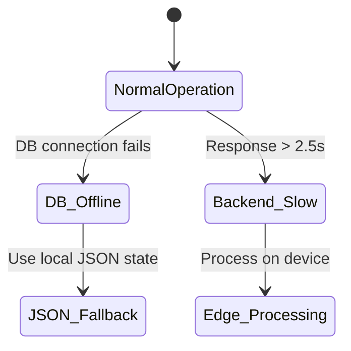
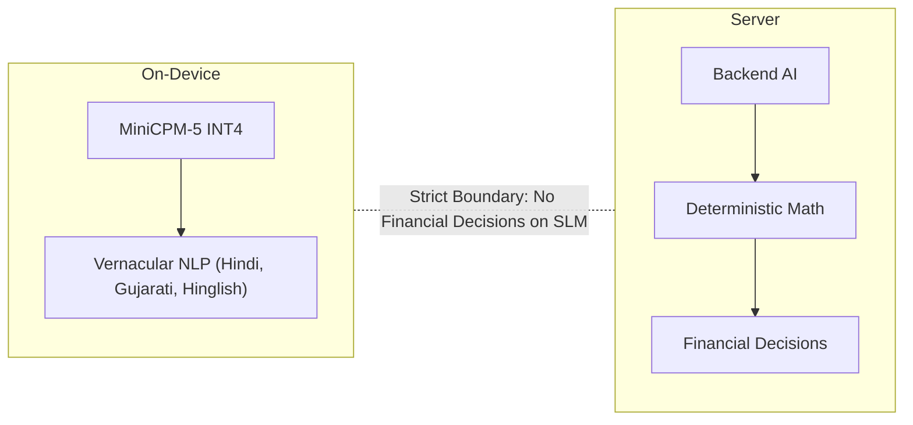

# VZEYA / ABC Bank: Architecture Overview

The Bharat Adaptive Banking platform is an AI-powered personalization and experience layer that sits on top of legacy core banking systems. The platform is built around a Server-Driven UI (SDUI) philosophy and deterministic AI decision-making.

The system consists of three main components, independently owned:
- **Frontend** (Lakshya): React Native / Expo mobile app
- **Backend** (Harsh): FastAPI Python API server  
- **AI Engine** (Ubaid): Python ML/intelligence pipeline + on-device Voice SLM

## System Philosophy

- **Server-Driven UI (SDUI):** The AI determines the customer's reality, which the Backend synthesizes into an Experience Config. The Frontend acts as a "dumb renderer".
- **Strict Interface Contracts:** JSON Schema Draft-07 contracts decouple all three domains, ensuring strong boundaries and independent evolution.
- **Contract Files:**
  - `contracts/customer-state.schema.json` (AI → Backend)
  - `contracts/experience.schema.json` (Backend → Frontend)
  - `contracts/voice-intent.schema.json` (Voice → Backend)
- **Responsible AI:** Generative AI never makes financial decisions. All decisions are based on deterministic math (e.g., DTI > 0.40 strictly suppresses credit products).
- **Cryptographic Audit Trail:** A SHA-256 hash chain is maintained for every AI decision.

## Runtime Components

1. **PostgreSQL 16:** (Docker, port 5432) - Stores `customers`, `accounts`, `transactions`, `recurring_payments`, `customer_events`, `products`, `customer_products`, and `consent_preferences`.
2. **FastAPI Backend:** (port 8000) - REST API providing 15+ endpoints, experience composition, safety policy enforcement, and a behavioral engine.
3. **AI Intelligence Pipeline:** (Python) - Ingests 7 data sources (CBS, UPI, SMS, Bureau, BBPS, NCMC, KYC), extracts features, detects signals, generates customer state, and scores recommendations.
4. **React Native / Expo Mobile App:** Features an adaptive home screen, Mitra AI chat, payments, transactions, and profile.
5. **On-Device SLM (MiniCPM-5 INT4):** Runs locally on the user's phone for vernacular NLP (Hindi, Gujarati, Hinglish).

## Key Design Decisions

- **Dual AI Architecture:** Backend AI uses deterministic math for financial decisions, while the On-Device SLM (MiniCPM-5) is strictly used for vernacular NLP and never for financial decisions.
- **7 Bharat Archetypes:** Personalization is driven by archetypes such as `urban_commuter`, `rural_farmer`, etc.
- **Graceful Degradation:** Built-in resilience where DB offline triggers a JSON fallback, and a slow backend (>2.5s timeout) triggers offline edge processing.
- **Database Migrations:** Alembic is strictly used to manage migrations. Prisma is used ONLY for introspection and studio viewing.

---

## Architecture Diagrams

### 1. High-Level System Architecture

### 2. Server-Driven UI Flow

### 3. Data Pipeline Flow

### 4. Runtime Deployment

### 5. Contract Boundaries

### 6. Graceful Degradation

### 7. Dual AI Architecture

