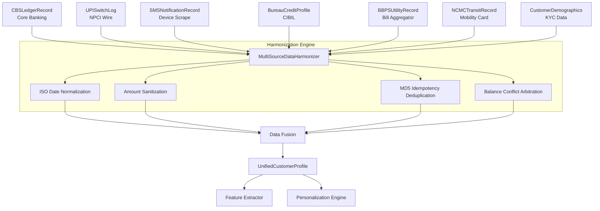

# Data Ingestion & Harmonization Pipeline

## 1. Overview
The ABC Bank platform relies on a sophisticated multi-source data ingestion pipeline specifically designed for the Indian banking ecosystem. It aggregates, sanitizes, and harmonizes dirty, heterogeneous data feeds from diverse sources into a single `UnifiedCustomerProfile`.

This pipeline handles real-world complexities such as:
- Conflicting balance statements between core banking and SMS alerts
- Unstructured merchant names in UPI switch wire logs
- Heterogeneous timestamp formats across different institutions
- Deduplication of events when the same transaction triggers a CBS ledger update, a UPI log, and an SMS notification

## 2. The 7 Data Source Models

The pipeline consumes data via 7 distinct Pydantic schemas representing various facets of a user's financial footprint in India.

### 2.1 CBSLedgerRecord
**Purpose**: Raw ledger records directly from Core Banking Systems (e.g., Finacle, BaNCS).
**Key Fields**:
- `txn_id` (str): Unique transaction identifier.
- `account_number` (Optional[str]): Account reference.
- `amount` (Any): Can be float, string, or None due to dirty upstream feeds.
- `type` (Optional[str]): "debit" or "credit".
- `balance_after` (Optional[Any]): Account balance post-transaction.
- `narration` (Optional[str]): Raw narration text.

### 2.2 UPISwitchLog
**Purpose**: NPCI / UPI switch wire logs containing unstructured reference strings.
**Key Fields**:
- `rrn` (str): Retrieval Reference Number (12 digits).
- `payer_vpa` / `payee_vpa` (Optional[str]): UPI Virtual Payment Addresses.
- `raw_upi_string` (Optional[str]): Messy wire string (e.g., "UPI/CR/.../DELHI METRO...").
- `amount` (Any): Transaction amount.

### 2.3 SMSNotificationRecord
**Purpose**: Parsed Android SMS / device notifications for real-time banking activity.
**Key Fields**:
- `sender_header` (Optional[str]): e.g., "VM-HDFCBK", "AXISBK".
- `body` (str): The raw SMS text.
- `received_at` (Optional[Any]): Flexible timestamp.

### 2.4 BureauCreditProfile
**Purpose**: Credit Bureau pull data (CIBIL, Experian, CRIF High Mark).
**Key Fields**:
- `bureau_name` (str): Defaults to "CIBIL".
- `score` (Optional[int]): Credit score (300-900).
- `active_tradelines_count` (int): Number of active credit lines.
- `total_outstanding_debt`, `monthly_emi_obligations`, `overdue_amount` (float).
- `dpd_status` (str): Days past due (e.g., "000", "030").

### 2.5 BBPSUtilityRecord
**Purpose**: Bharat Bill Payment System (BBPS) aggregator notifications.
**Key Fields**:
- `biller_id`, `biller_name` (str).
- `biller_category` (str): utilities, fastag, etc.
- `amount_due` (float).
- `wallet_balance` (Optional[float]): Useful for Fastag low-balance alerts.

### 2.6 NCMCTransitRecord
**Purpose**: National Common Mobility Card (NCMC) reader tap-in/out logs.
**Key Fields**:
- `card_id` (str).
- `current_stored_balance` (float).
- `last_tap_station`, `last_tap_time`.
- `daily_commute_detected` (bool).

### 2.7 CustomerDemographics
**Purpose**: Socioeconomic, regional, and KYC context.
**Key Fields**:
- `customer_id`, `name`.
- `city_tier` (str): Tier 1 to 4 / Rural.
- `declared_monthly_income` (Optional[float]).

## 3. MultiSourceDataHarmonizer

The `MultiSourceDataHarmonizer` is the enterprise-grade engine that fuses these 7 sources into a canonical profile.

### Core Mechanisms
- **Flexible Timestamp Parsing**: Handles ISO-8601, Epoch (millis/seconds), and varied DD/MM/YYYY formats seamlessly via `parse_flexible_timestamp`.
- **Amount Cleaning**: Standardizes dirty strings like "₹ 1,450.50" into pure float values via `clean_amount`.
- **UPI Wire Parsing**: Extracts actionable merchant names and categories from complex strings using `parse_upi_wire_string`.
- **SMS Regex Extraction**: Uses robust regex patterns (`SMS_DEBIT_PATTERN`, `SMS_CREDIT_PATTERN`, `SMS_BAL_PATTERN`) to extract amounts, merchants, and balances from unformatted text.
- **Idempotency Hash (MD5 Dedup)**: Computes a deterministic MD5 signature `hash(merchant | amount | tx_type | date_prefix)` to catch duplicate transactions reported by multiple sources (e.g., an SMS and a CBS log for the same debit).
- **Balance Conflict Arbitration**: Resolves conflicts when a recent SMS reports a different balance than an older CBS statement, favoring the most chronologically recent data point.

## 4. UnifiedCustomerProfile

The output of the Harmonizer is the `UnifiedCustomerProfile`, a canonical schema ready for downstream ML feature extraction.

**Key Components**:
- `customer_id`, `customer_name`, `monthly_income` (inferred if missing).
- `balance`: Aggregated dictionary containing available, savings, transit_wallet, and fastag balances.
- `cleaned_transactions`: A deduplicated, chronologically sorted list of transactions enriched with merchant name, category, and recurring status.
- `bureau_summary`: Normalized credit health metrics, including derived DTI (Debt-to-Income) ratio.
- `utility_alerts`: Upcoming BBPS bill and Fastag obligations.
- `demographics`: Base demographics merged with inferred flags (e.g., `transit_commute_detected`).
- `sanitization_audit`: Diagnostic metrics tracing exactly how many raw records were parsed, how many duplicates were dropped, and how many balance conflicts were resolved.

## 5. Ingestion Pipeline Architecture

