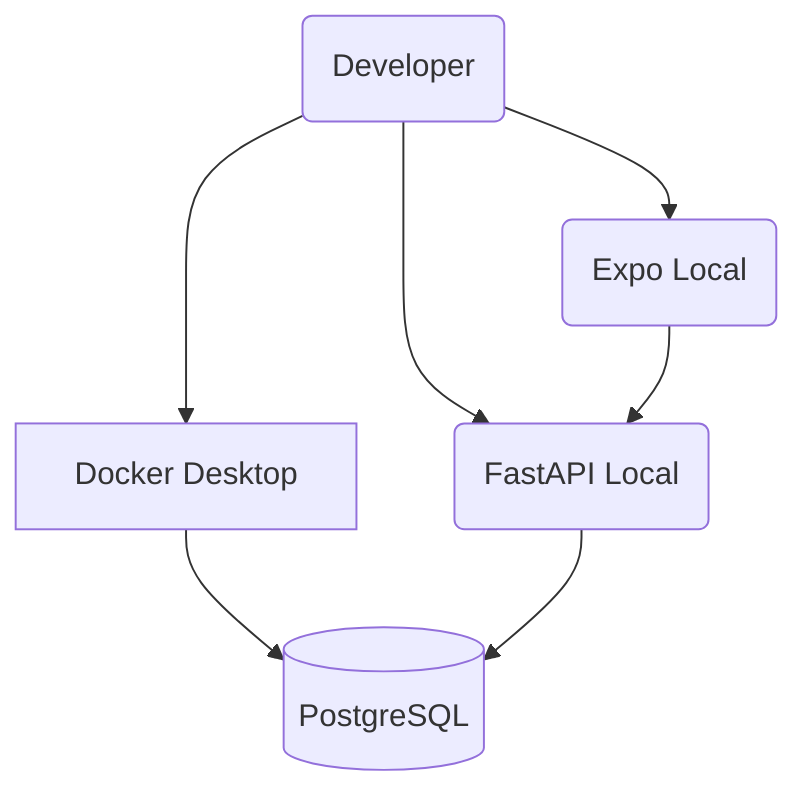
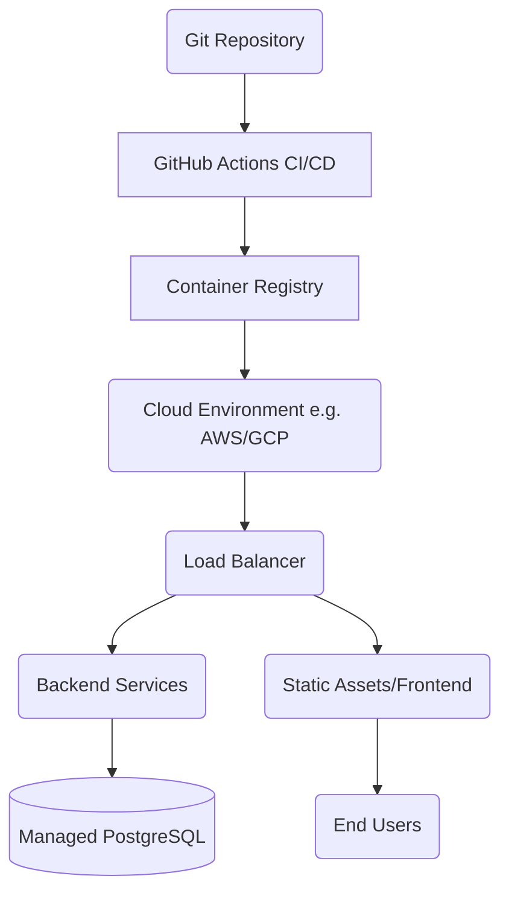

# Build and Deployment Overview

Documentation detailing the build, deployment, and infrastructure strategy for the ABC Bank project.

## Current Infrastructure
- Docker Compose: PostgreSQL 16 (Alpine) only
- Backend: FastAPI/Uvicorn (local development)
- Frontend: Expo development server
- No production deployment pipeline configured

## Build Process
- Backend: No build step (Python, runs directly)
- Frontend: `npx expo start` for dev, `eas build` for production (requires EAS config)
- AI: No build step (Python modules imported by backend)

## Docker
```yaml
services:
  db:
    image: postgres:16-alpine
    ports: 5432:5432
    volumes: postgres_data
    healthcheck: pg_isready
```

## Database Migrations
- Alembic managed in `apps/backend/app/db/alembic/`
- Run: `alembic upgrade head`
- Prisma introspection: `npm run db:introspect` (read-only)

### Database Migration Flow


## Environment Promotion
- Development: Local Docker PostgreSQL + local servers
- Production: Tunnel to AWS RDS via localhost:5433 (referenced in `.env.example`)

## Architecture Diagrams

### Current Deployment Architecture



### Recommended Production Architecture



## What Exists vs What's Recommended

**Currently Implemented:**
- Docker Compose for PostgreSQL
- Local development servers
- Manual deployment
- Alembic migrations

**Not Yet Implemented (Recommended):**
- Dockerized backend/frontend services
- CI/CD pipeline (GitHub Actions)
- Staging environment
- Health check monitoring
- Log aggregation
- HTTPS/TLS configuration
- Production CORS restrictions
- Automated database backups

## Demo Scripts
- `scripts/run-demo.ps1` (Windows PowerShell)
- `scripts/run-demo.sh` (Unix/macOS)
