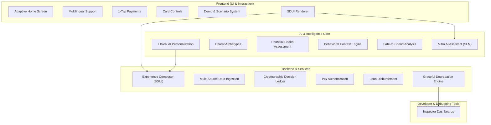
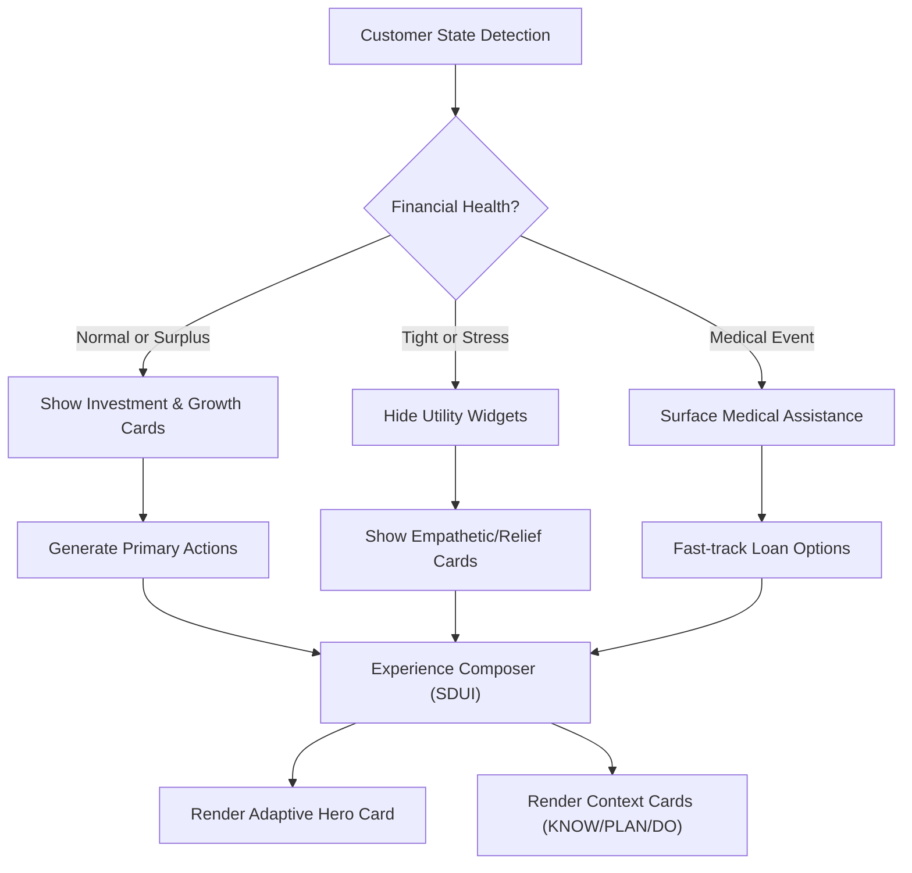
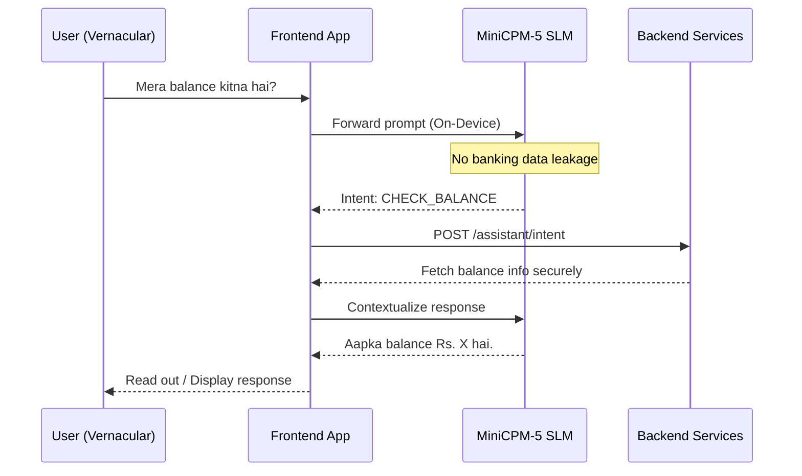
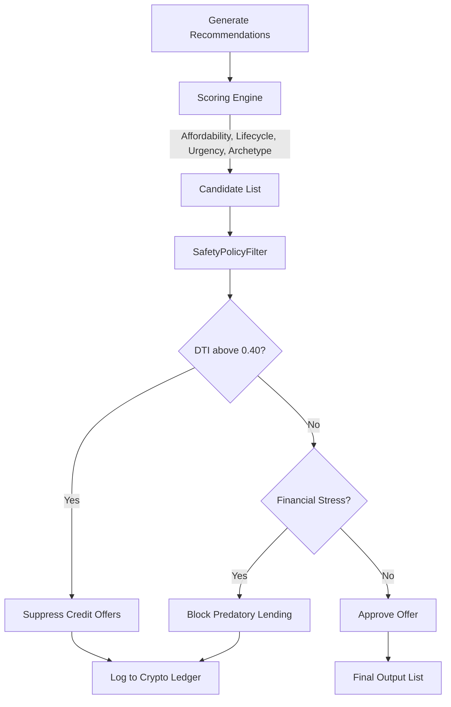
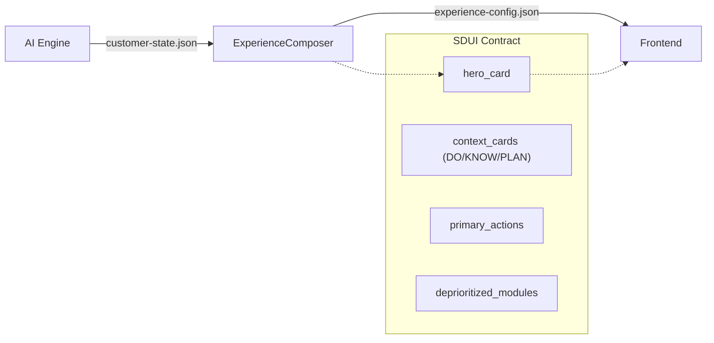
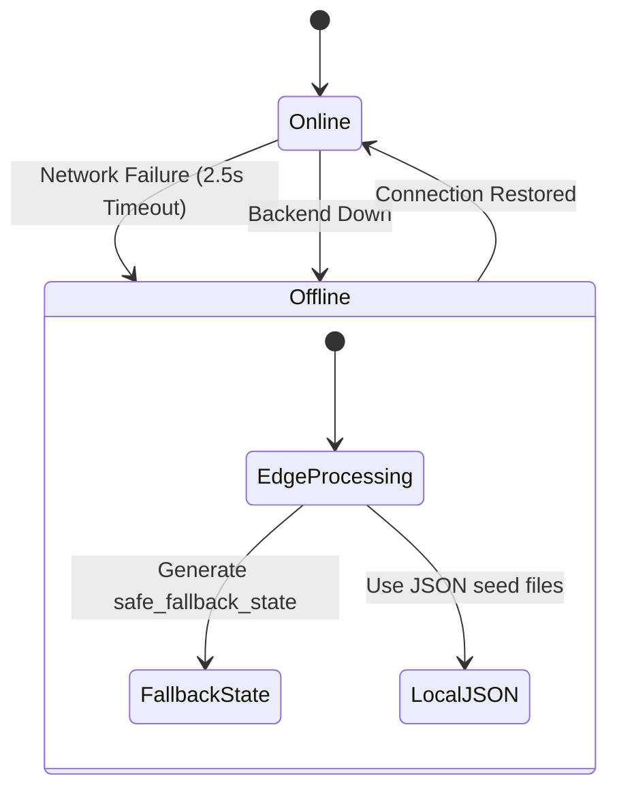

# ABC Bank Platform - Feature Inventory

This document details the major features of the ABC Bank platform, including their implementation details, technical components, and dependencies.

## Diagrams

### 1. Feature Map

### 2. Adaptive Home Screen Flow

### 3. Mitra Assistant Flow

### 4. Ethical AI Decision Flow

### 5. SDUI Contract Flow

### 6. Graceful Degradation

## Feature Inventory

### 1. Adaptive Home Screen
- **What**: Dynamic dashboard that morphs based on customer's financial state
- **Implementation**: `apps/frontend/src/features/home/AdaptiveHomeScreen`, `apps/backend/app/experience/composer.py`
- **APIs**: GET/POST to Experience API
- **Data/DB**: `customer-state.json` inputs, derived from DB state
- **Dependencies**: React, ExperienceComposer, Intelligence Pipeline
- **Edge cases**: Fallbacks to normal state if intelligence fails or times out.

### 2. Mitra AI Assistant (Vernacular Voice & Chat)
- **What**: Conversational AI assistant supporting Hindi, Gujarati, Hinglish, English
- **Implementation**: `apps/frontend/src/features/assistant/MitraChatScreen`
- **APIs**: `POST /assistant/intent`, `POST /assistant/chat`, `GET /assistant/init`
- **Data/DB**: Secure backend fetching for intents
- **Dependencies**: MiniCPM-5 SLM (INT4)
- **Edge cases**: SLM failure gracefully fails back to generic prompt buttons; unhandled intents trigger human handoff.

### 3. Ethical AI Personalization
- **What**: Multi-factor recommendation scoring with mandatory ethical guardrails
- **Implementation**: `ai/intelligence/personalization/scorer.py`, `compliance.py`, `cryptoledger.py`, `apps/backend/app/services/safety_policy.py`
- **APIs**: Backend internal logic invoked before returning recommendations
- **Data/DB**: Audit logs, crypto ledger chain
- **Dependencies**: SHA-256 for tampering protection
- **Edge cases**: Strict fallback block if DTI or stress checks fail to run.

### 4. Server-Driven UI (SDUI)
- **What**: Backend determines exactly what UI the frontend renders
- **Implementation**: SDUI parsing in Frontend, `experience-config.json` generator in Backend
- **APIs**: SDUI payload delivery via Experience API
- **Data/DB**: `experience.schema.json`, `customer-state.json`
- **Dependencies**: Contract adherence between Frontend & Backend
- **Edge cases**: Malformed JSON from backend triggers local fallback UI.

### 5. Bharat Archetypes
- **What**: 7 customer archetypes for Indian-market personalization
- **Implementation**: `ai/intelligence/personalization/` and services taxonomy
- **APIs**: Internal mapping functions
- **Data/DB**: Demographic profiles mapping
- **Dependencies**: Scoring engine
- **Edge cases**: Unknown archetype defaults to generic `salaried_professional` logic.

### 6. Multi-Source Data Ingestion
- **What**: Ingests from 7 Indian banking data sources
- **Implementation**: `ai/intelligence/ingestion/harmonizer.py`
- **APIs**: Webhooks, ETL cron jobs
- **Data/DB**: Core Banking System, UPI logs, SMS, CIBIL, BBPS, NCMC, KYC
- **Dependencies**: MD5 hashing, ISO date normalization
- **Edge cases**: Invalid source dates/data dropped with alerts, conflict resolution prioritizes CBS.

### 7. Financial Health Assessment
- **What**: Classifies customer financial health as thriving/stable/tight/stress
- **Implementation**: `ai/intelligence/signals/financial.py`, `detector.py`
- **APIs**: Internal signal API
- **Data/DB**: Transaction histories, balance snapshots
- **Dependencies**: Ingestion pipeline
- **Edge cases**: Incomplete data yields `stable` to avoid false alarm panics.

### 8. Behavioral Context Engine
- **What**: Detects habits and provides time-aware contextual suggestions
- **Implementation**: `apps/backend/app/services/behavior_engine.py`
- **APIs**: Internal triggers during Experience Composition
- **Data/DB**: Clustered behavior logs
- **Dependencies**: Intelligence timeline analyzer
- **Edge cases**: Mis-categorized habits suppressed by explicit user feedback.

### 9. 1-Tap Payments
- **What**: Instant recurring mandate payments with biometric auth
- **Implementation**: Frontend home screen biometric auth module
- **APIs**: `POST /payments/transfer`
- **Data/DB**: Mandate ledger, Payments table
- **Dependencies**: `expo-local-authentication`
- **Edge cases**: Biometric failure falls back to PIN.

### 10. Card Controls
- **What**: Lock/unlock cards and set limits
- **Implementation**: `_card_controls` in StateService
- **APIs**: `GET /cards`, `POST /cards`
- **Data/DB**: Card state in DB
- **Dependencies**: Core banking mocked backend
- **Edge cases**: Conflicting concurrent updates handled via optimistic locking.

### 11. Loan Disbursement
- **What**: Instant credit up to ₹1,50,000
- **Implementation**: Loan service flow
- **APIs**: `POST /loans/disburse`
- **Data/DB**: Loan ledgers
- **Dependencies**: SafetyPolicyFilter
- **Edge cases**: Network drop during disbursement holds state in PENDING for manual/cron reconciliation.

### 12. PIN Authentication
- **What**: Secure PIN creation and verification
- **Implementation**: Auth module
- **APIs**: `POST /auth/pin/setup`, `POST /auth/pin/verify`
- **Data/DB**: User credentials table
- **Dependencies**: PBKDF2-HMAC-SHA256
- **Edge cases**: Exceeding rate limits triggers temporary account lockout.

### 13. Graceful Degradation (Offline-First)
- **What**: App continues working without backend connectivity
- **Implementation**: Edge engine, DataLoader fallbacks, `_create_safe_fallback_state`
- **APIs**: HTTP interceptors tracking timeouts (2.5s)
- **Data/DB**: Local JSON seed files
- **Dependencies**: Offline storage capability
- **Edge cases**: Outdated local cache warns user but permits read-only viewing.

### 14. Demo & Scenario System
- **What**: Switch between pre-built scenarios to demonstrate personalization
- **Implementation**: `PrototypeLabModal`, `ArchitectureFlowModal`
- **APIs**: `POST /scenario/switch`
- **Data/DB**: `data/scenarios/*.json`
- **Dependencies**: State hot-reloading
- **Edge cases**: Missing scenario files revert to `normal` baseline.

### 15. Cryptographic Decision Ledger
- **What**: SHA-256 tamper-proof audit chain of all AI decisions
- **Implementation**: `ai/intelligence/personalization/cryptoledger.py`
- **APIs**: Internal ledger append methods
- **Data/DB**: Audit chain database
- **Dependencies**: SHA-256 hashing functions
- **Edge cases**: DB write failure triggers fatal error to prevent unaudited actions.

### 16. Multilingual Support
- **What**: Full UI and voice support for English, Hindi, Gujarati
- **Implementation**: `apps/frontend/src/i18n/`
- **APIs**: Translation dictionary loading
- **Data/DB**: Local i18n JSON files
- **Dependencies**: MiniCPM-5 SLM for Hinglish/code-switching logic
- **Edge cases**: Missing keys fall back to English.

### 17. Safe-to-Spend Analysis
- **What**: 50/30/20 budgeting rule applied to customer spend
- **Implementation**: `ai/intelligence/features/spend_analyzer.py`, `extractor.py`
- **APIs**: Internal signal API
- **Data/DB**: Analyzed category splits over 30 days
- **Dependencies**: Harmonizer categorization
- **Edge cases**: Irregular income streams prompt user for manual monthly income input.

### 18. Inspector Dashboards
- **What**: Live browser tools for debugging AI decisions
- **Implementation**: Web dashboard routes
- **APIs**: `/inspector`, `/voice-inspector`
- **Data/DB**: Real-time read replicas / telemetry data
- **Dependencies**: Dev server environment
- **Edge cases**: Disabled automatically in production builds.

### 19. Banking Relief Services
- **What**: Emergency financial relief tools (10-day grace buffer, 50/50 split EMI, auto-sweep deficit, cooling-off cancellation)
- **Implementation**: `apps/backend/app/api/routes.py` (relief endpoints)
- **APIs**: `POST /api/v1/loans/grace`, `POST /api/v1/loans/split`, `POST /api/v1/loans/sweep-deficit`, `POST /api/v1/loans/cooling-off-cancel`
- **Data/DB**: Loan state and account ledgers
- **Dependencies**: Core banking mocked backend, Experience Composer
- **Edge cases**: Ineligible customers are gracefully denied with explanations.

### 20. Specialized Journey Modals
- **What**: Interactive micro-frontend journeys for niche banking tasks (Digital Rupee CBDC, ASBA IPO Bidding, Positive Pay Cheque, Forex Travel Card, Relationship Manager)
- **Implementation**: `apps/frontend/src/features/journeys/` (React Native Modals)
- **APIs**: Various specialized endpoints (e.g., `/api/v1/investments/asba/bid`)
- **Data/DB**: Integration with specific domain services
- **Dependencies**: SDUI actions triggering deep links to modals
- **Edge cases**: Network failures within modal gracefully prompt retry or fallback to call center.

### 21. JWT Authentication
- **What**: Stateless token-based security for customer sessions
- **Implementation**: `apps/backend/app/core/auth.py`
- **APIs**: `POST /api/v1/auth/register`, `POST /api/v1/auth/login`, `GET /api/v1/auth/me`
- **Data/DB**: Customers table with hashed passwords
- **Dependencies**: `PyJWT`, `passlib`
- **Edge cases**: Expired tokens trigger automatic silent refresh or prompt re-login.
