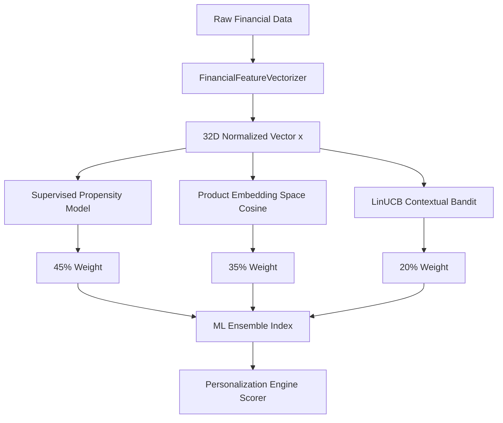
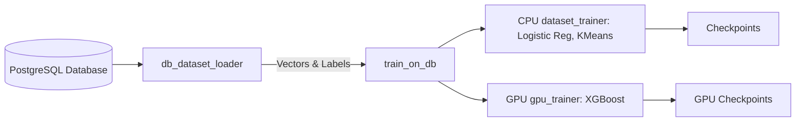
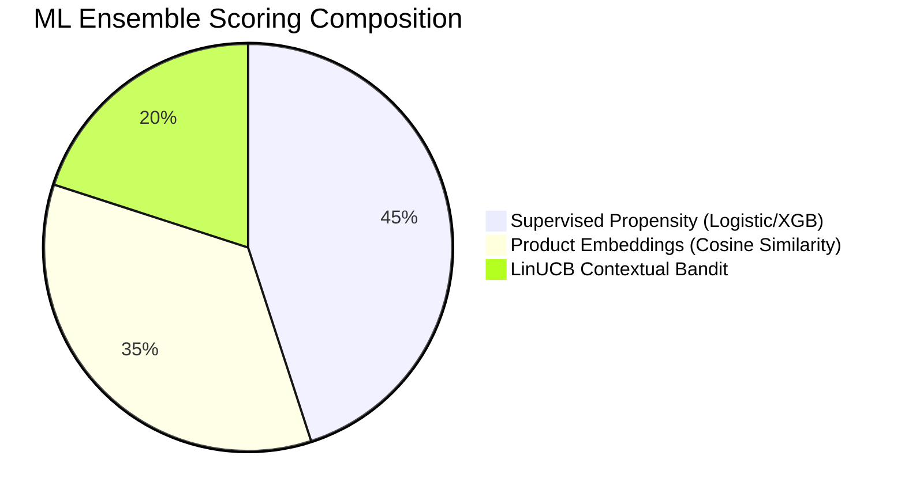

# ABC Bank ML Pipeline Architecture

## 1. Overview
The Machine Learning pipeline in ABC Bank forms the core of the intelligence domain (Python AI layer), transforming raw financial streams into actionable, highly personalized product recommendations. Positioned as the foundational brain of the system, it processes customer data into a standardized $\mathbb{R}^{32}$ vector space and feeds it into an ensemble of three models:
1. A Supervised Propensity Model (Logistic Regression / XGBoost)
2. A Product Embedding Space (Cosine Similarity)
3. A Reinforcement Learning Model (LinUCB Contextual Bandit)
Additionally, it provides unsupervised KMeans clustering to map users to archetypes.

## 2. 32D Feature Vector Space
The `FinancialFeatureVectorizer` maps disparate banking data into a standardized $\mathbb{R}^{32}$ normalized feature vector. All features are scaled to $[0.0, 1.0]$. 

The 32 feature names are:
1. `shannon_spend_entropy`
2. `burn_velocity`
3. `burn_acceleration`
4. `dti_ratio`
5. `liquid_buffer_months`
6. `savings_rate`
7. `discretionary_spend_ratio`
8. `essential_spend_ratio`
9. `healthcare_spend_ratio`
10. `transit_commute_ratio`
11. `agriculture_spend_ratio`
12. `merchant_vendor_ratio`
13. `debt_service_ratio`
14. `education_spend_ratio`
15. `periodic_transit_score`
16. `anomaly_score_normalized`
17. `spending_volatility`
18. `digital_adoption_index`
19. `micro_spend_ratio`
20. `max_transaction_concentration`
21. `credit_score_normalized`
22. `balance_to_income_ratio`
23. `reserve_ratio`
24. `inflow_frequency_score`
25. `inflow_regularity_score`
26. `deficit_risk_score`
27. `kyc_tier_normalized`
28. `age_normalized`
29. `weekend_spend_ratio`
30. `odd_hours_spend_ratio`
31. `bill_punctuality_score`
32. `financial_health_score`

**Key Derivation Formulas:**
- **Shannon Entropy:** $H(X) = - \sum (p_i \cdot \log_2(p_i))$ normalized by $\log_2(\max(2, N))$.
- **Burn Velocity:** Actual daily spend divided by expected daily spend (Income / 30), clipped at 3.0 and scaled by 3.0.
- **Credit Score Normalized:** $(CIBIL - 300) / 600$, clipped to $[0.0, 1.0]$.
- **DTI Ratio:** $EMI\_Volume / \max(1000, Income)$, capped effectively at $0.80$ for normalization.

## 3. Supervised Propensity Model
The `SupervisedPropensityModel` uses Scikit-Learn `LogisticRegression` (with balanced class weights and LBFGS solver) for 19 parallel binary classification tasks, one for each product. 

**Training Data Synthesis:**
The `_synthesize_training_dataset` generates samples grounded in banking domain labels across $\mathbb{R}^{32}$. It injects contextual variations over the base KMeans seed profiles:
- **Fraud Spikes:** High anomaly ($0.85-0.99$) and odd hours ($0.60-0.95$). Triggers `rec_fraud_guard`.
- **Medical Emergency:** High healthcare ratio ($0.40-0.90$) and burn acceleration ($0.70-0.95$). Triggers `rec_medical_claim`.
- **Debt Stress:** High DTI ($0.60-0.95$), high deficit risk, zero health score. Triggers `rec_cashflow_guidance`.
- **Wealth Surplus:** High liquid buffer ($0.75-1.00$) and savings rate ($0.60-0.90$). Triggers `rec_smart_savings`.

**Model Upgrades:**
A GPU upgrade path exists via `load_gpu_models()` which attempts to load high-capacity XGBoost models trained via `gpu_trainer.py`.

## 4. Product Embedding Space
The `ProductEmbeddingSpace` maps all 19 banking products into the same $\mathbb{R}^{32}$ continuous space using hand-crafted prototype vectors aligning with the 32 feature dimensions. 

Similarity is computed via **Cosine Similarity**:
$Sim(u, v) = \frac{u \cdot v}{||u|| \cdot ||v||}$
To match probability scale, it maps the similarity from $[-1.0, 1.0]$ to $[0.0, 1.0]$:
$Mapped = \frac{Sim + 1.0}{2.0}$

## 5. LinUCB Contextual Bandit
The `LinUCBBandit` handles the exploration-exploitation trade-off using a Disjoint Linear Upper Confidence Bound algorithm.

**UCB Formula:**
$UCB_a(x) = \theta_a^T x + \alpha \sqrt{x^T A_a^{-1} x}$
Where $\alpha = 0.25$ balances exploration. $\theta_a$ is estimated as $A_a^{-1} b_a$.

**Sherman-Morrison Online Update Rule:**
When feedback is received (e.g., reward $r$), the covariance matrix $A_a$ and reward vector $b_a$ are updated:
$A_a \leftarrow A_a + x x^T$
$b_a \leftarrow b_a + r x$
The inverse matrix $A_a^{-1}$ is incrementally maintained or recalculated. Checkpoints pre-warm these matrices to avoid the cold-start problem.

## 6. KMeans Archetype Clustering
`KMeansClusterer` groups customers into 7 distinct Bharat archetypes:
1. `URBAN_COMMUTER`
2. `MSME_MERCHANT`
3. `GIG_WORKER`
4. `RURAL_FARMER`
5. `STUDENT_FIRST_EARNER`
6. `SENIOR_PENSIONER`
7. `HOMEMAKER_SHG`

**Mechanism:**
- **Seed Profiles:** Generates 40 synthetic samples per cluster from defined R^32 prototypes.
- **Bipartite Matching:** Uses `scipy.optimize.linear_sum_assignment` to optimally align empirical cluster centroids to canonical archetype prototypes.
- **Soft Assignment:** Probability across archetypes via temperature-scaled softmax:
  $P(C_j | x) = \text{softmax}\left(-\frac{||x - \mu_j||^2}{2 \tau^2}\right)$ (with $\tau=0.5$).

## 7. ML Ensemble Scoring
The ensemble logically fuses outputs to compute a unified probability logic:
- **45% Supervised Propensity:** Baseline classification fit.
- **35% Cosine Similarity:** Unsupervised vector alignment.
- **20% LinUCB Bandit:** Dynamic reinforcement learning exploration.

This produces the `ml_ensemble_index` utilized by the Personalization Engine.

## 8. Database Training Pipeline
The end-to-end training follows a comprehensive pipeline:
1. **`db_dataset_loader.py`**: Queries PostgreSQL (`customers`, `accounts`, `transactions`, `events`), aggregates longitudinal signals, and vectorizes into $\mathbb{R}^{32}$.
2. **`dataset_trainer.py`**: Executes CPU training (KMeans, Logistic Regression) and serializes joblib artifacts.
3. **`gpu_trainer.py`**: A high-throughput NVIDIA CUDA pipeline fitting deep XGBoost histogram gradient-boosted trees over continuous streaming batches.
4. **`train_on_db.py`**: The master orchestrator invoking extraction, KMeans clustering with bipartite matching, bandit pre-warming, CPU propensity, and GPU XGBoost training, generating all final checkpoints.

## 9. Checkpoint Artifacts

| Artifact | Purpose | Estimate Size/Content |
|---|---|---|
| `propensity_models_v1.joblib` | CPU LogisticRegression models (19 models) | ~1-5 MB |
| `gpu_propensity_models_v1.joblib` | XGBoost Gradient Boosted Trees for GPU execution | ~50-100 MB |
| `kmeans_archetypes_v1.joblib` | Unsupervised k=7 KMeans model & centroid map | < 1 MB |
| `linucb_bandit_prior_v1.json` | Pre-warmed $A$ matrices and $b$ vectors | Small JSON |
| `metadata.json` / `gpu_metadata.json` | Training execution summaries, ROC-AUC metrics | Text |

## 10. Diagrams

### ML Scoring Pipeline Flow

### Training Pipeline Flow

### Ensemble Composition

