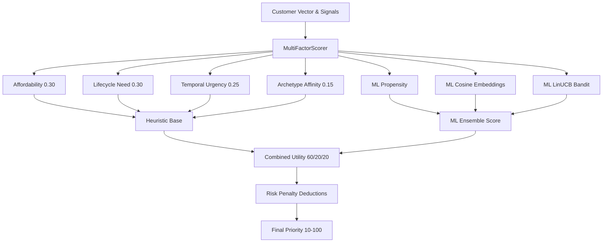
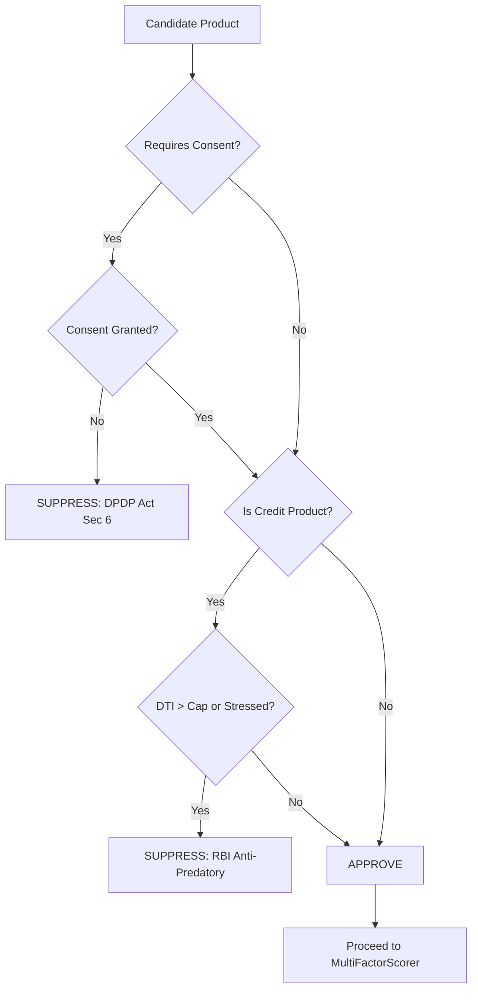
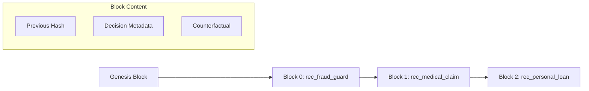

# ABC Bank Personalization Engine Architecture

## 1. Overview
The Personalization Engine acts as the central orchestration layer bridging raw AI/ML metrics with rigid regulatory compliance, behavioral scoring, and customer-facing audits. It determines the ultimate ranking and suitability of 19 distinct banking products based on real-time financial vectors, multi-factor heuristics, and cryptographic non-repudiation ledgers.

## 2. MultiFactorScorer
The `MultiFactorScorer` computes mathematically calibrated propensity scores combining ML predictions with rigid heuristics. 

**Component Weights:**
The heuristic base applies 4 distinct components summing to 1.0:
- **Affordability Fit (0.30):** Evaluates Debt-to-Income (DTI) and liquid buffer capacity. E.g., credit products see sharp decreases if DTI > product limits.
- **Lifecycle Need (0.30):** Contextual correlation with life shocks (e.g., medical surges, fraud anomalies, commute patterns).
- **Temporal Urgency (0.25):** Calculates time-of-day or seasonal urgency (e.g., peak morning commute transit reloads, upcoming bill due dates).
- **Archetype Affinity (0.15):** Suitability match between product category and customer archetype (e.g., KCC Top-up for `rural_farmer`).

**ML & Utility Synthesis:**
The final score fuses heuristics and ML (`ml_ensemble_index` combining Logistic, Cosine, Bandit):
$$Combined\_Utility = 0.60 \times ML\_Ensemble + 0.20 \times Timing + 0.20 \times Affordability$$

**Risk Penalty:**
Applied against discretionary or borrowing actions. Stress/tight health adds 0.80 penalty; anomalies > 80 add 0.70.
$$Effective\_Multiplier = Combined\_Utility \times (1.0 - Risk\_Penalty)$$
The raw score dynamically sets the ultimate priority (10 to 100).

## 3. ComplianceEngine
The `ComplianceEngine` acts as an absolute gatekeeper against predatory lending and privacy violations.

**Key Regulatory Enforcement:**
- **RBI Digital Lending Guidelines (2022):** Enforces a DTI cap based on `max_dti_limit` (typically 0.40) and applies the Anti-Predatory Shield if financial health is 'stress' or 'tight'.
- **DPDP Act 2023 (Sec 6):** Enforces strict purpose limitation. Products requiring specific `requires_consent_scope` (e.g., `fraud_monitoring`) are hard-suppressed if consent is withdrawn.

**Confidence Score Calculation:**
Computed (0.0 to 1.0) based on data density (35%), spending consistency (25%), KYC tenure (20%), and temporal recency (20%). High volatility reduces consistency scores.

**Counterfactual Explanations:**
If a product is suppressed, the engine generates actionable counterfactuals (e.g., "Customer debt-to-income ratio must reduce below 0.40").

## 4. CryptographicDecisionChain
The `CryptographicDecisionChain` provides tamper-evident, non-repudiation logging for every recommendation and suppression.

**Mechanics:**
- **Schema (`CryptographicBlock`):** Contains `block_index`, `timestamp`, `customer_id`, `decision`, `confidence_score`, `regulatory_rules`, `counterfactual`, `previous_hash`, and `block_hash`.
- **SHA-256 Hash Chaining:** `compute_block_hash` creates deterministic hashes linking to the `previous_hash`. It anchors to a `GENESIS_HASH`.
- **`build_chain()`:** Iterates over `DecisionAuditRecord` items, linking them continuously.
- **`verify_chain_integrity()`:** Recalculates hashes and checks previous block links to detect tampering mathematically.
- **Customer-Facing Plain Explanations:** Translates strict logic into empathetic guidance (e.g., "We held back 'X' today to protect your financial wellness. How to unlock...").

## 5. BankingProductCatalog
The `PRODUCT_CATALOG` (`BankingProduct` schema) maintains 19 deeply defined products. Key parameters include `max_dti_limit`, `requires_consent_scope`, and `base_priority`.

**Categories include:**
- Security (`rec_fraud_guard`, `srv_positive_pay`)
- Healthcare (`rec_medical_claim`)
- Guidance (`rec_cashflow_guidance`)
- Transport (`rec_commute_metro`, `srv_ncmc_reload`, `srv_fastag_recharge`)
- Savings & Wealth (`rec_smart_savings`, `rec_senior_scss`)
- Credit (`rec_personal_loan`, `rec_msme_credit_line`, `rec_credit_builder`)
- Micro-Insurance (`rec_sachet_insurance`)
- Agri Credit (`rec_kcc_topup`)

## 6. BharatArchetypeProfiles
The `ArchetypeClassifier` segments customers using transactional heuristics into 7 Bharat personas:
1. **Urban Salaried Commuter (`urban_commuter`)**
2. **Tier-2/3 MSME Trader (`msme_merchant`)**
3. **Gig Economy Partner (`gig_worker`)**
4. **Agriculturalist & Farmer (`rural_farmer`)**
5. **Student & First-Time Earner (`student_first_earner`)**
6. **Senior Citizen & Pensioner (`senior_pensioner`)**
7. **Homemaker & SHG Entrepreneur (`homemaker_shg`)**

Classification analyzes corporate salary frequency, metro transit, platform credits (Zomato/Swiggy), agricultural spends, and pharmacy/pension data.

## 7. PersonalizationEngine Orchestration
End-to-End Orchestration via `PersonalizationEngine.evaluate()`:
1. **Classify Archetype**: Maps customer.
2. **Vectorize**: Transforms data to 32D vector.
3. **Cluster Probabilities**: Unsupervised KMeans soft assignment.
4. **Compliance Confidence**: Calculates engine confidence score.
5. **Iterate Catalog**: For each of the 19 products:
   - Check RBI/DPDP Compliance.
   - If approved and contextually relevant, evaluate `MultiFactorScorer`.
   - Compile `DecisionAuditRecord`.
6. **Sort & Rank**: Orders active recommendations by priority.
7. **Output**: Returns JSON containing Top 5 recommendations, suppressed items, cryptographic audit trail, and ML metadata.

## 8. DecisionAuditRecord
The `DecisionAuditRecord` schema persists:
- `audit_id`, `timestamp`
- `decision` (RECOMMEND / SUPPRESS)
- `confidence_score`
- `primary_reason`, `regulatory_rules_enforced`
- `input_signals_snapshot` (dti, anomaly, etc.)
- `counterfactual_explanation`

## 9. Diagrams

### Scoring Pipeline

### Compliance Decision Flow

### Crypto-Ledger Chain

