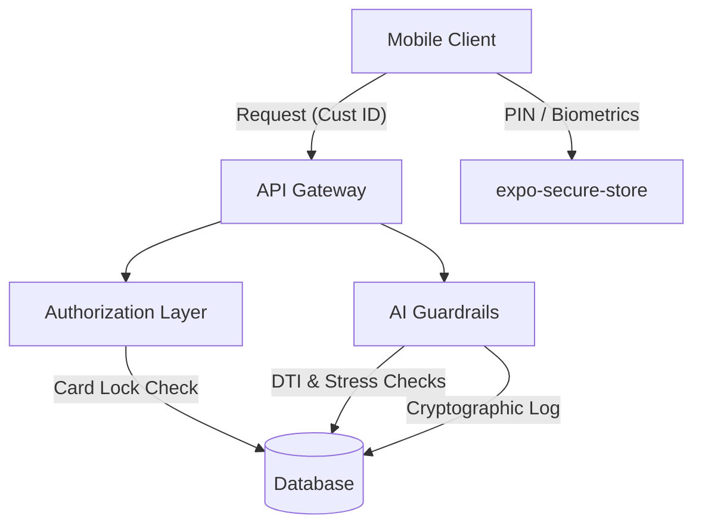
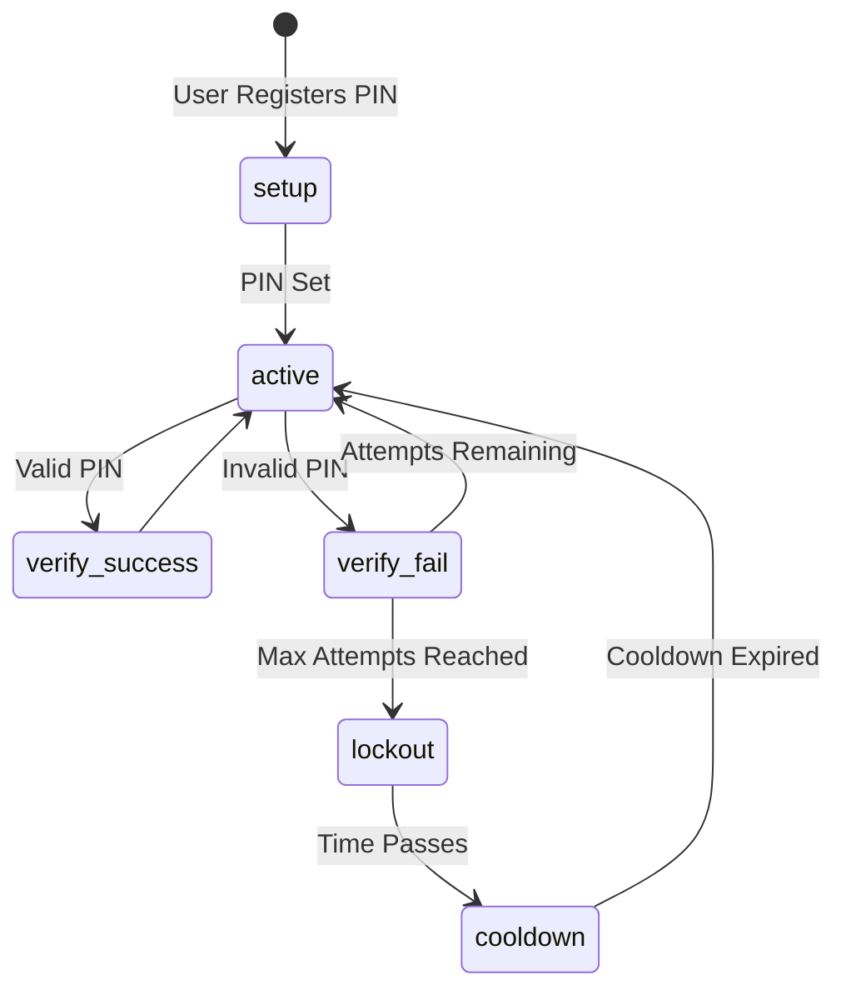
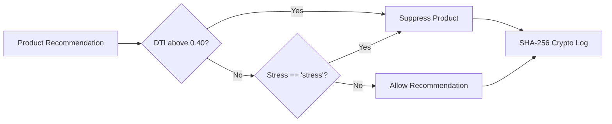
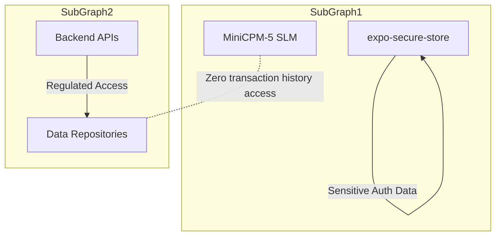

# Security Architecture Overview

This document outlines the comprehensive security mechanisms implemented for the ABC Bank system.

## Authentication Mechanisms
1. **JWT Tokens**: Uses HS256 JWT tokens with a 24-hour expiration for secure API access.
2. **PIN**: PBKDF2-HMAC-SHA256, 100k iterations, 16-byte salt, constant-time comparison, and rate limiting.
3. **Biometrics**: Uses `expo-local-authentication` on the mobile client.

## Authorization
- **JWT Claims**: Authorization is governed by validating JWT bearer tokens (using `get_current_customer_claims()`) rather than simple path parameters.
- **Card Lock Gates**: The `is_locked` flag blocks payments and card-related activities.
- **SafetyPolicyFilter**: Blocks credit recommendations for users identified as financially stressed.

## Ethical AI Safety
- **Debt-to-Income (DTI)**: If DTI > 0.40, all credit, loan, and payday products are suppressed.
- **Financial Health**: If `financial_health == 'stress'`, predatory lending is strictly blocked.
- **Audit Trail**: A SHA-256 cryptographic decision ledger is maintained for all AI-driven decisions.
- **Transparency**: Counterfactual explanations are provided to users.
- **Decision Making**: No generative AI makes final financial decisions.

## Data Validation
- **Pydantic**: Uses `BaseModel` with `Field` validators.
- **PAN regex**: `^[A-Z]{5}[0-9]{4}[A-Z]$`
- **Aadhaar regex**: `^\d{12}$`
- **Loan limits**: Maximum loan amount is capped at ₹1,50,000.

## CORS
- **Current State**: `allow_origins=["*"]` (Development mode - needs strict restriction for production deployment).

## On-Device Security
- **MiniCPM-5 SLM**: Guaranteed Zero Banking Data Leakage - the SLM never processes or sees transaction history.
- **Storage**: Uses `expo-secure-store` for sensitive on-device storage.
- **Voice Prompts**: Designed with strict guidelines for zero-leakage translation.

## Known Limitations
- PIN state is stored in-memory (lost upon server restart).
- CORS is wide open (suitable for development only).
- No HTTPS enforcement at the application level.
- No CSRF protection currently in place.
- No rate limiting on general endpoints (only implemented for PIN verification).

## Compliance
- **RBI**: Strict enforcement of Debt-to-Income (DTI) caps.
- **DPDP (Digital Personal Data Protection)**: Enforces purpose limitations.
- **Consent**: A `consent_preferences` table manages user data consent.

---

## Diagrams

### 1. Security Architecture Overview

### 2. PIN Lifecycle

### 3. Ethical AI Guard Rails

### 4. Data Protection Boundaries

