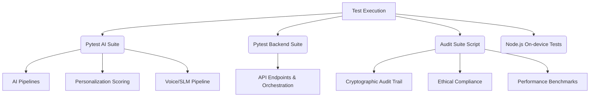
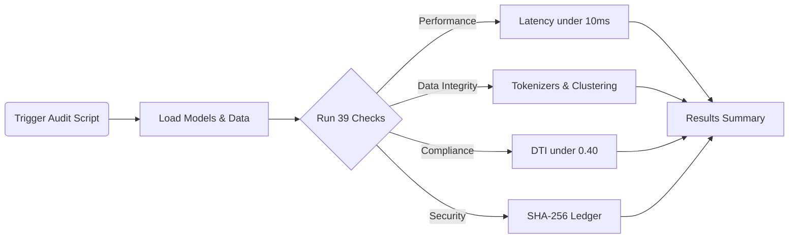

# Testing Overview

Documentation covering the testing strategy and execution for the ABC Bank project.

## Test Suites

### 1. AI Tests (45 tests, 0.39s total in `ai/tests/`)
- `test_massive_load.py`: 10k transactions under 100ms benchmark
- `test_multi_source_ingestion.py`: SMS vs CBS conflict arbitration
- `test_personalization.py`: Ethical loan suppression, Top-1-to-5 ranking
- `test_cadence.py`: Dual cadence timing verification
- `test_cryptoledger.py`: SHA-256 chain integrity
- `test_voice_slm.py`: Voice pipeline testing

### 2. Backend Test Suite (66 tests in `apps/backend/tests/`)
- `test_auth.py` — JWT auth registration, login, protected routes
- `test_authentic_banking.py` — Authentic banking scenarios
- `test_authentic_banking_relief.py` — Banking relief (grace, split EMI, sweep)
- `test_backend_orchestration.py` — Full orchestration pipeline
- `test_behavioral_engine.py` — Behavioral engine logic
- `test_database.py` — Database operations
- `test_experience.py` — Experience composition

### 3. Audit Suite (39 checks in `scripts/audit_and_verify_all.py`)
- ONNX inference latency (<10ms)
- Subword tokenizer vector integrity
- XGBoost propensity extraction
- KMeans archetype soft-clustering
- Strict DTI loan suppression (<0.40)
- 50/30/20 spend breakdowns
- SHA-256 cryptographic decision ledger integrity
- Multi-turn/vernacular chatbot routing

### 4. Session Checkpoint (`.session-checkpoint.md`)
- Records: 111 tests passed (45 AI + 66 backend), 39 audit checks passed
- N+1 query optimization verified
- <1ms recommendation generation achieved

## Test Architecture

## How to Run
- `pytest ai/tests/` - Run AI test suite
- `pytest apps/backend/tests/` - Run Backend test suite
- `python scripts/audit_and_verify_all.py` - Run full audit
- `python scripts/test_ondevice_intent.js` - Test on-device intents (Node.js)
- `cd apps/frontend && npx tsc --noEmit` - Frontend TypeScript verification

### Audit Verification Flow

## Test Data
- `data/seed/customers.json`: 1.2k mock profiles
- `data/seed/transactions.json`: Longitudinal transaction history
- `data/scenarios/*.json`: Scenario overrides for testing different states

## Coverage Areas
- Backend API endpoints & Orchestration ✔
- AI intelligence pipeline ✔
- Personalization scoring ✔
- Ethical compliance/suppression ✔
- Cryptographic audit trail ✔
- Voice/SLM pipeline ✔
- Data ingestion ✔
- Performance benchmarks ✔

## Gaps
- No frontend component tests (aside from TS compilation check)
- No end-to-end integration tests involving the mobile frontend directly
- No CI/CD automated test runs configured
