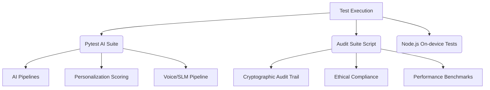
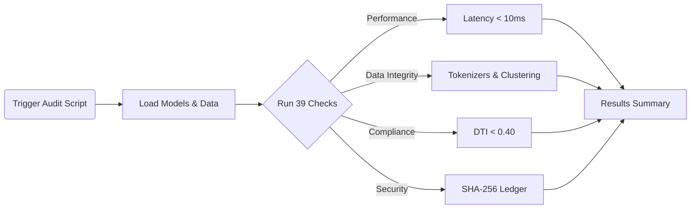

# Testing Overview

Documentation covering the testing strategy and execution for the ABC Bank project.

## Test Suites

### 1. AI Tests (45 tests, 0.39s total in `ai/tests/`)
- `test_massive_load.py`: 10k transactions under 100ms benchmark
- `test_multi_source_ingestion.py`: SMS vs CBS conflict arbitration
- `test_personalization.py`: Ethical loan suppression, Top-1-to-5 ranking
- `test_cadence.py`: Dual cadence timing verification
- `test_cryptoledger.py`: SHA-256 chain integrity
- `test_voice_slm.py`: Voice pipeline testing

### 2. Audit Suite (39 checks in `scripts/audit_and_verify_all.py`)
- ONNX inference latency (<10ms)
- Subword tokenizer vector integrity
- XGBoost propensity extraction
- KMeans archetype soft-clustering
- Strict DTI loan suppression (<0.40)
- 50/30/20 spend breakdowns
- SHA-256 cryptographic decision ledger integrity
- Multi-turn/vernacular chatbot routing

### 3. Session Checkpoint (`.session-checkpoint.md`)
- Records: 111 tests passed, 39 audit checks passed
- N+1 query optimization verified
- <1ms recommendation generation achieved

## Test Architecture

## How to Run
- `pytest ai/tests/` - Run AI test suite
- `python scripts/audit_and_verify_all.py` - Run full audit
- `python scripts/test_ondevice_intent.js` - Test on-device intents (Node.js)

### Audit Verification Flow

## Test Data
- `data/seed/customers.json`: 1.2k mock profiles
- `data/seed/transactions.json`: Longitudinal transaction history
- `data/scenarios/*.json`: Scenario overrides for testing different states

## Coverage Areas
- AI intelligence pipeline ✔
- Personalization scoring ✔
- Ethical compliance/suppression ✔
- Cryptographic audit trail ✔
- Voice/SLM pipeline ✔
- Data ingestion ✔
- Performance benchmarks ✔

## Gaps
- No dedicated backend API endpoint tests (pytest for routes)
- No frontend component tests
- No end-to-end integration tests
- No CI/CD automated test runs configured
